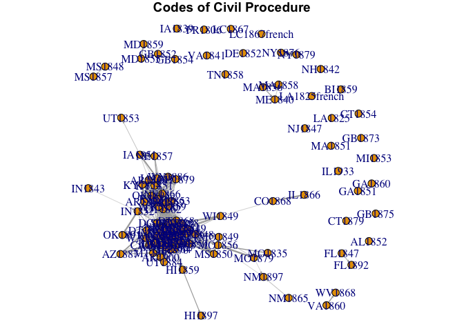
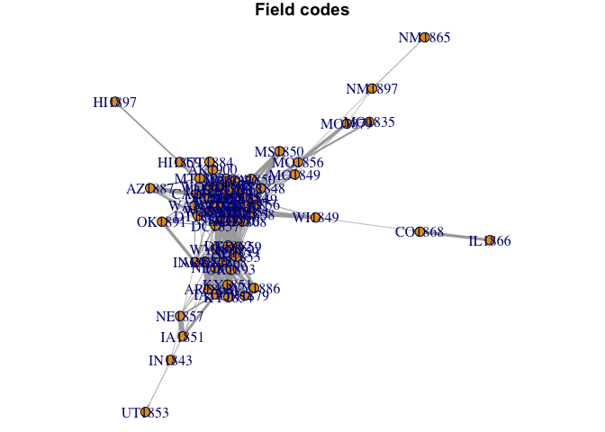
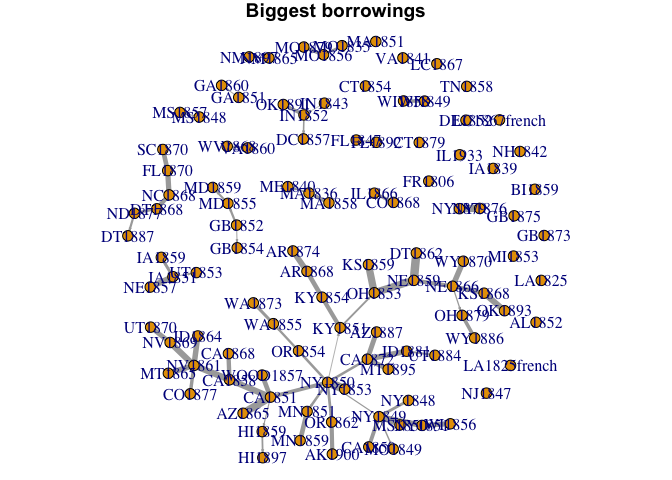
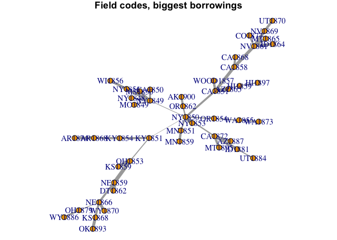
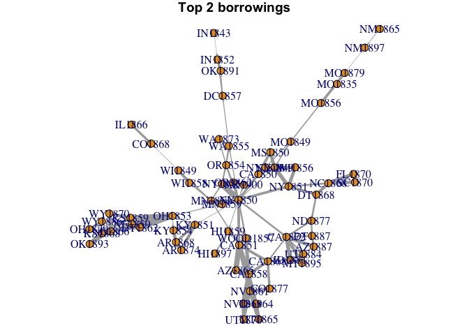

# Network analysis of code to code comparison
Lincoln Mullen  
September 24, 2015  


```r
library("textreuse")
library("stringr")
library("dplyr")
library("igraph")
source("R/extract-date.R")
source("R/plot_network.R")
```

Load the corpus previously created and hashed. We won't compare the extended codes.


```r
cache <- "cache/corpus-shingle-ngrams-n7.rds"
corpus_shingles <- readRDS(cache)
corpus_shingles <- corpus_shingles[!str_detect(names(corpus_shingles), "extended")]
```

Now we will do the pairwise comparison of the codes.


```r
cache_pairwise <- "cache/comparison-matrix-pairwise-n7-ratio.rds"
if (!file.exists(cache_pairwise)) {
  comparisons <- pairwise_compare(corpus_shingles, ratio_of_matches,
                                  directional = TRUE)
  saveRDS(comparisons, cache_pairwise)
} else {
  comparisons <- readRDS(cache_pairwise)
}
```

Now we need to filter the obviously anachronistic comparisons. The way to read the directional matrix is "column borrows from row." Therefore we want to give a cell in the matrix an `NA` value if the year in the column is greater than the year in the row.


```r
indices <- arrayInd(1:length(comparisons), dim(comparisons), useNames = TRUE)
check_anachronism <- function(x) {
  row <- x["row"]
  col <- x["col"]
  row_date <- extract_date(rownames(comparisons)[row])
  col_date <- extract_date(colnames(comparisons)[col])
  if (col_date < row_date) comparisons[row, col] <<- NA
}
throwaway <- apply(indices, MARGIN = 1, check_anachronism)
rm(throwaway)
```

Now we are going to remove matches below a threshold. Also, we have to make `NA` values into `0` values so that there are no edges drawn in igraph.


```r
comparisons_filtered <- comparisons
match_threshold <- 0.05
comparisons_filtered[comparisons_filtered < match_threshold] <- NA
comparisons_filtered[is.na(comparisons_filtered)] <- 0
```

Let's make a network graph, using this matrix as an adjacency matrix.


```r
g <- graph.adjacency(comparisons_filtered, mode = "directed", weighted = TRUE,
                     diag = FALSE) 
set.seed(4821)
l <- layout.fruchterman.reingold(g, weights = E(g)$weight)
par(mar = c(0,0,1,0))
plot(g, edge.width = E(g)$weight * 8, layout = l,
     edge.arrow.size = 0.15, vertex.size = 5)
title("Codes of Civil Procedure")
```

 

Using a 5% threshold seems to deliver the appropriate clusters. There is a clear Field Code cluster, and the laws on the periphery make sense. Most legislation from the South, Mid-Atlantic, and New England was not directly related to the Field text, and the periphery comprises most of that legislation. Morever, the lines of connection in the periphery make sense. We know from independent sources that Maryland looked to English reforms, and there is indeed a cluster connecting Maryland to British reform acts. Florida enacted the Field Code as a Reconstruction measure in 1870, but then repealed it entirely at the end of the decade. This graph shows a connection between late- and early-century Florida with no connection to FL1870, which will be found in the Field Code cluster. This is all what we would expect, given information in independent sources.

Next we want to get the families of codes. We will decompose the main graph into its components, then plot a network graph of each. 


```r
families <- decompose(g, min.vertices = 2)
```

Plot the biggest family.


```r
plot_network(families[[1]], graph_title = "Field codes")
```

 

This is still a bit of a hairball, even when zoomed in quite a bit. The difficulty is this. Suppose California borrows from New York, and Nevada borrows from California. We still detect the borrowings of Nevada from New York, even though they are not direct. So let's make a network of only the biggest borrowings for each code, i.e., the maximum value in each column.


```r
comparisons_max <- comparisons_filtered
col_max_index <- apply(comparisons_max, MARGIN = 2, max, na.rm = TRUE)
throwaway <- lapply(names(col_max_index), function(n) {
  subset <- comparisons_max[,n] != col_max_index[n]
  comparisons_max[subset, n] <<- 0
})
```

Now make a network graph of just those biggest comparions.


```r
g_max <- graph.adjacency(comparisons_max, mode = "directed", weighted = TRUE,
                         diag = FALSE) 
plot_network(g_max, "Biggest borrowings")
```

 

That is a far better picture of what is going on, because we can actually see the family tree effect. There are some problems, e.g., NC1868 is most like DT1868, but it should actually be connected to NY 1850 (which is close in value). Including two connections, or just removing known incorrect values, would make the graph better for communicating.

Let's get just the main family.


```r
plot_network(decompose(g_max)[[1]],
             graph_title = "Field codes, biggest borrowings")
```

 

It is difficult to filter the matrix of scores. Let's turn that into a data frame of pairs of nodes with edge weights (i.e., the scores), and then manipulate that with dplyr's richer vocabulary.


```r
borrowings <- pairwise_candidates(comparisons, directional = TRUE) %>% 
  filter(score >= 0.05) %>% 
  rename(origin = a, destination = b) %>% 
  mutate(origin_date = extract_date(origin),
         destination_date = extract_date(destination)) %>% 
  filter(destination_date >= origin_date)
borrowings
```

```
## Source: local data frame [828 x 5]
## 
##    origin destination      score origin_date destination_date
##     (chr)       (chr)      (dbl)       (int)            (int)
## 1  AR1868      AR1874 0.47078120        1868             1874
## 2  AR1868      KS1868 0.07621215        1868             1868
## 3  AR1868      OK1893 0.06877370        1868             1893
## 4  AR1868      WY1870 0.08135652        1868             1870
## 5  AZ1865      AK1900 0.05322616        1865             1900
## 6  AZ1865      CA1868 0.29435802        1865             1868
## 7  AZ1865      CA1872 0.14473721        1865             1872
## 8  AZ1865      CO1877 0.24510202        1865             1877
## 9  AZ1865      DT1868 0.10719138        1865             1868
## 10 AZ1865      FL1870 0.14045740        1865             1870
## ..    ...         ...        ...         ...              ...
```

Let's keep only the top two borrowings for each code and turn that into a graph.


```r
g_top2 <- borrowings %>% 
  group_by(destination) %>% 
  top_n(2, score) %>% 
  graph.data.frame(directed = TRUE)
E(g_top2)$weight <- E(g_top2)$score
plot_network(decompose(g_top2)[[1]], "Top 2 borrowings")
```

 

We will have to decide if the top 1 connections chart with corrections or the top 2 connections is better. But for now these seem like accurate results.
