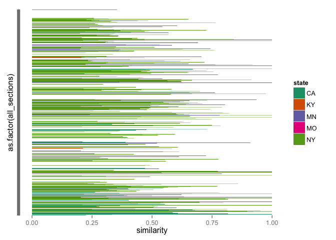
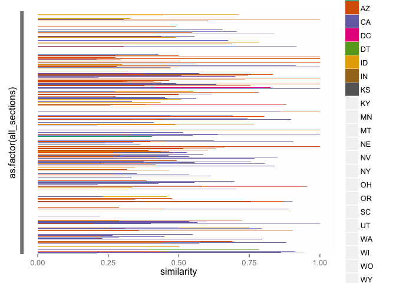

# Best matches for code sections
Lincoln Mullen  
September 25, 2015  


```r
library("dplyr")
library("stringr")
library("readr")
library("ggplot2")
library("RColorBrewer")
source("R/extract-date.R")
source("R/extract_code_names.R")
```

The aim of this notebook is to create a function that takes a code's abbreviation (e.g., `NY1850`) and creates a data frame with each of the sections in that code with the best match to a non-anachronistic code.

Read in the data.


```r
scores <- read_csv("out/scores-all-sections-pairs.csv")
scores <- scores %>% 
  rename(section_a = a, section_b = b) %>% 
  mutate(code_a = extract_code_names(section_a),
         code_b = extract_code_names(section_b),
         year_a = extract_date(code_a),
         year_b = extract_date(code_b))
scores
```

```
## Source: local data frame [227,579 x 8]
## 
##          section_a       section_b similarity dissimilarity code_a code_b
##              (chr)           (chr)      (dbl)         (dbl)  (chr)  (chr)
## 1  AK1900-00000020 CA1872-00000860  0.2625000      0.737500 AK1900 CA1872
## 2  AK1900-00000020 DC1857-00003280  0.1369860      0.863014 AK1900 DC1857
## 3  AK1900-00000020 DT1868-00000360  0.0781250      0.921875 AK1900 DT1868
## 4  AK1900-00000020 DT1868-00000370  0.2692310      0.730769 AK1900 DT1868
## 5  AK1900-00000020 DT1887-00000700  0.3125000      0.687500 AK1900 DT1887
## 6  AK1900-00000020 KS1859-00000140  0.1842110      0.815789 AK1900 KS1859
## 7  AK1900-00000020 KS1868-00000160  0.0601504      0.939850 AK1900 KS1868
## 8  AK1900-00000020 KY1851-00000160  0.1571430      0.842857 AK1900 KY1851
## 9  AK1900-00000020 MN1851-00000040  0.1184210      0.881579 AK1900 MN1851
## 10 AK1900-00000020 MO1849-00000090  0.0823529      0.917647 AK1900 MO1849
## ..             ...             ...        ...           ...    ...    ...
## Variables not shown: year_a (int), year_b (int)
```


```r
best_section_matches <- function(code_name, scores, threshold = 0.1, top = 1) {
  require("dplyr")
  require("stringr")
  matches <- scores %>% 
    filter(code_a == code_name | code_b == code_name) %>% 
    mutate(match_code = ifelse(code_a == code_name, code_b, code_a),
           code_of_interest = ifelse(code_a == code_name, code_a, code_b),
           match_section = ifelse(code_a == code_name, section_b, section_a),
           section_of_interest = ifelse(code_a == code_name, section_a, section_b),
           match_year = ifelse(code_a == code_name, year_b, year_a)) %>% 
    filter(match_code != code_of_interest,
           match_year <= extract_date(code_name),
           similarity >= threshold) %>% 
    select(code_of_interest, section_of_interest, match_code, match_section,
           similarity, dissimilarity) %>% 
    group_by(section_of_interest) %>%
    arrange(desc(similarity)) %>% 
    top_n(top, similarity) 
  
  all_sections <- Sys.glob(str_c("legal-codes-split/", code_name, "-0*")) %>% 
    str_replace("legal-codes-split/", "") %>% 
    str_replace("\\.txt", "")
  all <- data_frame(all_sections)
  
  all %>% 
    left_join(matches, by = c("all_sections" = "section_of_interest")) %>% 
    select(-code_of_interest)
} 
```

Also a function to calculate summary statistics.


```r
summarize_borrowings <- function(section_list) {
  section_list %>% 
    group_by(match_code) %>% 
    summarize(mean_similarity = mean(similarity),
              n = n()) %>% 
    mutate(percentage_sections = n / nrow(section_list)) %>% 
    arrange(desc(n))
}
```

Apply this to three codes:


```r
CA1851 <- best_section_matches("CA1851", scores, threshold = 0.2)
CA1851
```

```
## Source: local data frame [819 x 5]
## 
##       all_sections match_code   match_section similarity dissimilarity
##              (chr)      (chr)           (chr)      (dbl)         (dbl)
## 1  CA1851-00000010     CA1850 CA1850-00000010   0.224138      0.775862
## 2  CA1851-00000020     NY1849 NY1849-00000630   0.333333      0.666667
## 3  CA1851-00000030         NA              NA         NA            NA
## 4  CA1851-00000040     CA1850 CA1850-00000040   1.000000      0.000000
## 5  CA1851-00000050     CA1850 CA1850-00000070   1.000000      0.000000
## 6  CA1851-00000060     CA1850 CA1850-00000090   0.619048      0.380952
## 7  CA1851-00000070     CA1850 CA1850-00000100   0.815385      0.184615
## 8  CA1851-00000080     NY1850 NY1850-00007050   0.500000      0.500000
## 9  CA1851-00000090     CA1850 CA1850-00000120   0.607843      0.392157
## 10 CA1851-00000100     NY1850 NY1850-00007070   0.461538      0.538462
## ..             ...        ...             ...        ...           ...
```

```r
summarize_borrowings(CA1851)
```

```
## Source: local data frame [9 x 4]
## 
##   match_code mean_similarity     n percentage_sections
##        (chr)           (dbl) (int)               (dbl)
## 1         NA              NA   408         0.498168498
## 2     NY1850       0.4990981   302         0.368742369
## 3     CA1850       0.5198949    51         0.062271062
## 4     NY1849       0.4955549    19         0.023199023
## 5     NY1851       0.4554329    12         0.014652015
## 6     KY1851       0.4579496    10         0.012210012
## 7     MN1851       0.5098427    10         0.012210012
## 8     MO1849       0.5832048     4         0.004884005
## 9     NY1848       0.5146467     3         0.003663004
```

```r
IA1859 <- best_section_matches("IA1859", scores, threshold = 0.2)
IA1859
```

```
## Source: local data frame [702 x 5]
## 
##       all_sections     match_code           match_section similarity
##              (chr)          (chr)                   (chr)      (dbl)
## 1  IA1859-00000010             NA                      NA         NA
## 2  IA1859-00000020             NA                      NA         NA
## 3  IA1859-00000030             NA                      NA         NA
## 4  IA1859-00000040             NA                      NA         NA
## 5  IA1859-00000050         OH1853         OH1853-00000030   0.592593
## 6  IA1859-00000050 OH1853extended OH1853extended-00000030   0.592593
## 7  IA1859-00000060             NA                      NA         NA
## 8  IA1859-00000070             NA                      NA         NA
## 9  IA1859-00000080             NA                      NA         NA
## 10 IA1859-00000090         IA1851         IA1851-00000170   0.516854
## ..             ...            ...                     ...        ...
## Variables not shown: dissimilarity (dbl)
```

```r
summarize_borrowings(IA1859)
```

```
## Source: local data frame [20 x 4]
## 
##        match_code mean_similarity     n percentage_sections
##             (chr)           (dbl) (int)               (dbl)
## 1              NA              NA   417         0.594017094
## 2          IA1851       0.3881678   162         0.230769231
## 3          NE1857       0.3763200    43         0.061253561
## 4          KY1851       0.3546307    18         0.025641026
## 5          OH1853       0.3692748    12         0.017094017
## 6  OH1853extended       0.3692748    12         0.017094017
## 7          TN1858       0.3946903    10         0.014245014
## 8          DC1857       0.3193847     6         0.008547009
## 9          KS1859       0.2798807     6         0.008547009
## 10         IN1852       0.3653533     3         0.004273504
## 11         MD1855       0.3319445     2         0.002849003
## 12         NY1850       0.3526945     2         0.002849003
## 13         WA1855       0.4583330     2         0.002849003
## 14         CA1850       0.4000000     1         0.001424501
## 15         CA1851       0.3118280     1         0.001424501
## 16         IN1843       0.2643170     1         0.001424501
## 17         MO1856       0.3452380     1         0.001424501
## 18         NY1849       0.2586210     1         0.001424501
## 19         NY1853       0.3053890     1         0.001424501
## 20         WI1856       0.2586210     1         0.001424501
```

```r
UT1870 <- best_section_matches("UT1870", scores, threshold = 0.2)
UT1870
```

```
## Source: local data frame [763 x 5]
## 
##       all_sections match_code   match_section similarity dissimilarity
##              (chr)      (chr)           (chr)      (dbl)         (dbl)
## 1  UT1870-00000010     CA1851 CA1851-00000010   0.211538     0.7884620
## 2  UT1870-00000020         NA              NA         NA            NA
## 3  UT1870-00000030     CA1850 CA1850-00000070   0.430769     0.5692310
## 4  UT1870-00000030     CA1851 CA1851-00000050   0.430769     0.5692310
## 5  UT1870-00000040     CA1851 CA1851-00000060   0.944444     0.0555556
## 6  UT1870-00000050     AZ1865 AZ1865-00000040   0.456790     0.5432100
## 7  UT1870-00000050     CA1851 CA1851-00000070   0.456790     0.5432100
## 8  UT1870-00000050     NV1869 NV1869-00000060   0.456790     0.5432100
## 9  UT1870-00000060         NA              NA         NA            NA
## 10 UT1870-00000070         NA              NA         NA            NA
## ..             ...        ...             ...        ...           ...
```

```r
summarize_borrowings(UT1870)
```

```
## Source: local data frame [33 x 4]
## 
##    match_code mean_similarity     n percentage_sections
##         (chr)           (dbl) (int)               (dbl)
## 1      NV1869       0.4945804   215          0.28178244
## 2      NV1861       0.5150640   112          0.14678899
## 3      CA1851       0.5117531   106          0.13892529
## 4      AZ1865       0.5211863    90          0.11795544
## 5          NA              NA    73          0.09567497
## 6      ID1864       0.4663555    39          0.05111402
## 7      MT1865       0.5305246    37          0.04849279
## 8      NY1850       0.5005181    18          0.02359109
## 9      CA1868       0.4607122     9          0.01179554
## 10     OR1854       0.4878706     9          0.01179554
## ..        ...             ...   ...                 ...
```

Make a plot of code borrowings.


```r
plot_borrowings <- function(state_borrowings) {
  state_borrowings %>% 
    mutate(state = str_extract(match_code, "\\w\\w")) %>% 
    ggplot(aes(x = as.factor(all_sections), y = similarity, fill = state)) +
    geom_bar(stat = "identity") +
    coord_flip() +
    scale_x_discrete(labels = NULL) +
    scale_y_continuous(limits = c(0, 1)) +
    scale_fill_brewer(palette = "Dark2")
}
```

Plot some borrowings:


```r
plot_borrowings(CA1851)
```

```
## Warning: Removed 408 rows containing missing values (position_stack).
```

```
## Warning in is.na(labels): is.na() applied to non-(list or vector) of type
## 'NULL'
```

 

```r
plot_borrowings(UT1870)
```

```
## Warning: Removed 73 rows containing missing values (position_stack).
```

```
## Warning in RColorBrewer::brewer.pal(n, pal): n too large, allowed maximum for palette Dark2 is 8
## Returning the palette you asked for with that many colors
```

```
## Warning in is.na(labels): is.na() applied to non-(list or vector) of type
## 'NULL'
```

```
## Warning in RColorBrewer::brewer.pal(n, pal): n too large, allowed maximum for palette Dark2 is 8
## Returning the palette you asked for with that many colors
```

 
