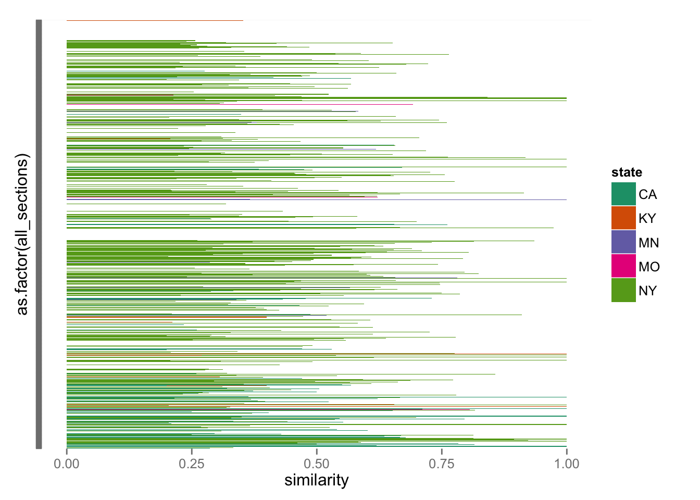
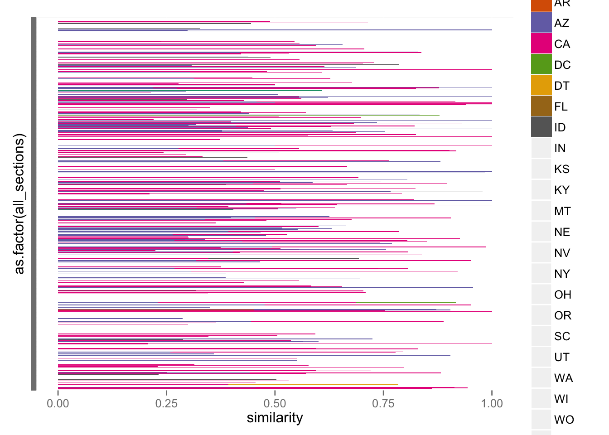

    library("dplyr")
    library("stringr")
    library("readr")
    library("ggplot2")
    library("RColorBrewer")
    source("R/extract-date.R")
    source("R/extract_code_names.R")

The aim of this notebook is to create a function that takes a code's
abbreviation (e.g., `NY1850`) and creates a data frame with each of the
sections in that code with the best match to a non-anachronistic code.

Read in the data.

    scores <- read_csv("out/scores-all-sections-pairs.csv")
    scores <- scores %>% 
      rename(section_a = a, section_b = b) %>% 
      mutate(code_a = extract_code_names(section_a),
             code_b = extract_code_names(section_b),
             year_a = extract_date(code_a),
             year_b = extract_date(code_b))
    scores

    ## Source: local data frame [274,359 x 8]
    ## 
    ##          section_a       section_b similarity dissimilarity code_a code_b
    ##              (chr)           (chr)      (dbl)         (dbl)  (chr)  (chr)
    ## 1  AK1900-00000010 AR1868-00000060  0.2162160      0.783784 AK1900 AR1868
    ## 2  AK1900-00000010 AR1874-00001960  0.3750000      0.625000 AK1900 AR1874
    ## 3  AK1900-00000010 AZ1865-00000020  0.2131150      0.786885 AK1900 AZ1865
    ## 4  AK1900-00000010 CA1850-00000030  0.1791040      0.820896 AK1900 CA1850
    ## 5  AK1900-00000010 CA1858-00000030  0.2131150      0.786885 AK1900 CA1858
    ## 6  AK1900-00000010 CA1872-00002310  0.1967210      0.803279 AK1900 CA1872
    ## 7  AK1900-00000010 CO1877-00000010  0.1730770      0.826923 AK1900 CO1877
    ## 8  AK1900-00000010 DC1857-00000970  0.3918920      0.608108 AK1900 DC1857
    ## 9  AK1900-00000010 DT1868-00000280  0.2761900      0.723810 AK1900 DT1868
    ## 10 AK1900-00000010 DT1887-00000640  0.0900474      0.909953 AK1900 DT1887
    ## ..             ...             ...        ...           ...    ...    ...
    ## Variables not shown: year_a (int), year_b (int)

    best_section_matches <- function(code_name, scores, threshold = 0.1, top = 1) {
      require("dplyr")
      require("stringr")
      matches <- scores %>% 
        filter(code_a == code_name | code_b == code_name) %>% 
        mutate(match_code = ifelse(code_a == code_name, code_b, code_a),
               code_of_interest = ifelse(code_a == code_name, code_a, code_b),
               match_section = ifelse(code_a == code_name, section_b, section_a),
               section_of_interest = ifelse(code_a == code_name, section_a, section_b),
               match_year = ifelse(code_a == code_name, year_b, year_a)) %>% 
        filter(match_code != code_of_interest,
               match_year <= extract_date(code_name),
               similarity >= threshold) %>% 
        select(code_of_interest, section_of_interest, match_code, match_section,
               similarity, dissimilarity) %>% 
        group_by(section_of_interest) %>%
        arrange(desc(similarity)) %>% 
        top_n(top, similarity) 
      
      all_sections <- Sys.glob(str_c("legal-codes-split/", code_name, "-0*")) %>% 
        str_replace("legal-codes-split/", "") %>% 
        str_replace("\\.txt", "")
      all <- data_frame(all_sections)
      
      all %>% 
        left_join(matches, by = c("all_sections" = "section_of_interest")) %>% 
        select(-code_of_interest)
    } 

Also a function to calculate summary statistics.

    summarize_borrowings <- function(section_list) {
      section_list %>% 
        group_by(match_code) %>% 
        summarize(mean_similarity = mean(similarity),
                  n = n()) %>% 
        mutate(percentage_sections = n / nrow(section_list)) %>% 
        arrange(desc(n))
    }

Apply this to three codes:

    CA1851 <- best_section_matches("CA1851", scores, threshold = 0.2)
    CA1851

    ## Source: local data frame [740 x 5]
    ## 
    ##       all_sections match_code   match_section similarity dissimilarity
    ##              (chr)      (chr)           (chr)      (dbl)         (dbl)
    ## 1  CA1851-00000010     CA1850 CA1850-00000010   0.285714      0.714286
    ## 2  CA1851-00000020     NY1849 NY1849-00000630   0.333333      0.666667
    ## 3  CA1851-00000030         NA              NA         NA            NA
    ## 4  CA1851-00000040     CA1850 CA1850-00000040   1.000000      0.000000
    ## 5  CA1851-00000050     CA1850 CA1850-00000070   1.000000      0.000000
    ## 6  CA1851-00000060     CA1850 CA1850-00000090   0.619048      0.380952
    ## 7  CA1851-00000070     CA1850 CA1850-00000100   0.815385      0.184615
    ## 8  CA1851-00000080     NY1850 NY1850-00007050   0.500000      0.500000
    ## 9  CA1851-00000090     CA1850 CA1850-00000120   0.782609      0.217391
    ## 10 CA1851-00000100     NY1850 NY1850-00007070   0.461538      0.538462
    ## ..             ...        ...             ...        ...           ...

    summarize_borrowings(CA1851)

    ## Source: local data frame [9 x 4]
    ## 
    ##   match_code mean_similarity     n percentage_sections
    ##        (chr)           (dbl) (int)               (dbl)
    ## 1     NY1850       0.5041585   313         0.422972973
    ## 2         NA              NA   311         0.420270270
    ## 3     CA1850       0.5151458    64         0.086486486
    ## 4     NY1849       0.5439915    15         0.020270270
    ## 5     NY1851       0.4553339    11         0.014864865
    ## 6     KY1851       0.4601335    10         0.013513514
    ## 7     MN1851       0.5440051    10         0.013513514
    ## 8     MO1849       0.5832048     4         0.005405405
    ## 9     NY1848       0.4083335     2         0.002702703

    IA1859 <- best_section_matches("IA1859", scores, threshold = 0.2)
    IA1859

    ## Source: local data frame [705 x 5]
    ## 
    ##       all_sections     match_code           match_section similarity
    ##              (chr)          (chr)                   (chr)      (dbl)
    ## 1  IA1859-00000010             NA                      NA         NA
    ## 2  IA1859-00000020             NA                      NA         NA
    ## 3  IA1859-00000030             NA                      NA         NA
    ## 4  IA1859-00000040             NA                      NA         NA
    ## 5  IA1859-00000050         OH1853         OH1853-00000030   0.592593
    ## 6  IA1859-00000050 OH1853extended OH1853extended-00000030   0.592593
    ## 7  IA1859-00000060             NA                      NA         NA
    ## 8  IA1859-00000070             NA                      NA         NA
    ## 9  IA1859-00000080             NA                      NA         NA
    ## 10 IA1859-00000090         IA1851         IA1851-00000170   0.516854
    ## ..             ...            ...                     ...        ...
    ## Variables not shown: dissimilarity (dbl)

    summarize_borrowings(IA1859)

    ## Source: local data frame [21 x 4]
    ## 
    ##        match_code mean_similarity     n percentage_sections
    ##             (chr)           (dbl) (int)               (dbl)
    ## 1              NA              NA   415         0.588652482
    ## 2          IA1851       0.3881678   162         0.229787234
    ## 3          NE1857       0.3763200    43         0.060992908
    ## 4          KY1851       0.3583913    18         0.025531915
    ## 5          OH1853       0.3569757    13         0.018439716
    ## 6  OH1853extended       0.3569757    13         0.018439716
    ## 7          TN1858       0.3779235    11         0.015602837
    ## 8          DC1857       0.3157854     8         0.011347518
    ## 9          KS1859       0.2922814     5         0.007092199
    ## 10         IN1852       0.3653533     3         0.004255319
    ## ..            ...             ...   ...                 ...

    UT1870 <- best_section_matches("UT1870", scores, threshold = 0.2)
    UT1870

    ## Source: local data frame [938 x 5]
    ## 
    ##       all_sections match_code   match_section similarity dissimilarity
    ##              (chr)      (chr)           (chr)      (dbl)         (dbl)
    ## 1  UT1870-00000010     CA1851 CA1851-00000010   0.211538     0.7884620
    ## 2  UT1870-00000020         NA              NA         NA            NA
    ## 3  UT1870-00000030     CA1850 CA1850-00000070   0.430769     0.5692310
    ## 4  UT1870-00000030     CA1851 CA1851-00000050   0.430769     0.5692310
    ## 5  UT1870-00000040     CA1851 CA1851-00000060   0.944444     0.0555556
    ## 6  UT1870-00000040     CA1868 CA1868-00000060   0.944444     0.0555556
    ## 7  UT1870-00000040     NV1869 NV1869-00000060   0.944444     0.0555556
    ## 8  UT1870-00000050     AZ1865 AZ1865-00000060   0.456790     0.5432100
    ## 9  UT1870-00000050     CA1851 CA1851-00000070   0.456790     0.5432100
    ## 10 UT1870-00000050     CA1858 CA1858-00000070   0.456790     0.5432100
    ## ..             ...        ...             ...        ...           ...

    summarize_borrowings(UT1870)

    ## Source: local data frame [34 x 4]
    ## 
    ##    match_code mean_similarity     n percentage_sections
    ##         (chr)           (dbl) (int)               (dbl)
    ## 1      NV1869       0.5027795   230          0.24520256
    ## 2      CA1858       0.5422966   125          0.13326226
    ## 3      CA1851       0.5367899   109          0.11620469
    ## 4      AZ1865       0.5357513   106          0.11300640
    ## 5      NV1861       0.5222738   106          0.11300640
    ## 6          NA              NA    72          0.07675906
    ## 7      MT1865       0.5462576    43          0.04584222
    ## 8      CA1868       0.5824809    39          0.04157783
    ## 9      ID1864       0.4889488    31          0.03304904
    ## 10     NY1850       0.4873133    17          0.01812367
    ## ..        ...             ...   ...                 ...

Make a plot of code borrowings.

    plot_borrowings <- function(state_borrowings) {
      state_borrowings %>% 
        mutate(state = str_extract(match_code, "\\w\\w")) %>% 
        ggplot(aes(x = as.factor(all_sections), y = similarity, fill = state)) +
        geom_bar(stat = "identity") +
        coord_flip() +
        scale_x_discrete(labels = NULL) +
        scale_y_continuous(limits = c(0, 1)) +
        scale_fill_brewer(palette = "Dark2")
    }

Plot some borrowings:

    plot_borrowings(CA1851)

    ## Warning: Removed 311 rows containing missing values (position_stack).

    ## Warning in is.na(labels): is.na() applied to non-(list or vector) of type
    ## 'NULL'

    plot_borrowings(UT1870)

    ## Warning: Removed 72 rows containing missing values (position_stack).

    ## Warning in RColorBrewer::brewer.pal(n, pal): n too large, allowed maximum for palette Dark2 is 8
    ## Returning the palette you asked for with that many colors

    ## Warning in is.na(labels): is.na() applied to non-(list or vector) of type
    ## 'NULL'

    ## Warning in RColorBrewer::brewer.pal(n, pal): n too large, allowed maximum for palette Dark2 is 8
    ## Returning the palette you asked for with that many colors

