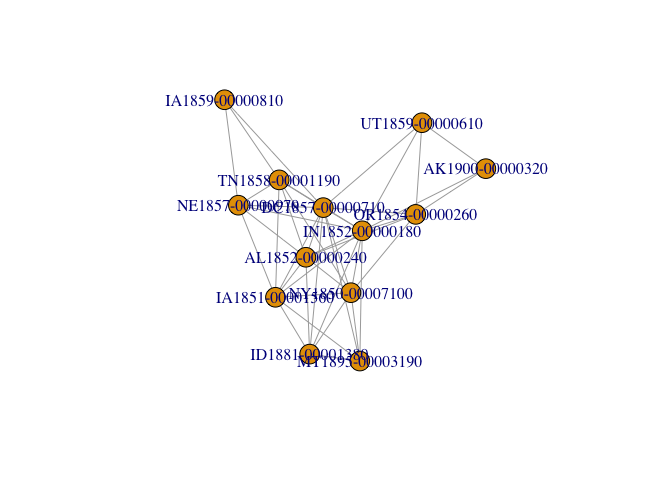
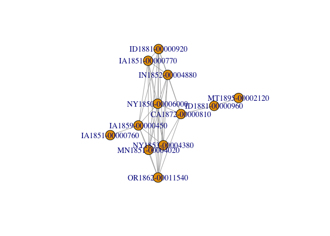
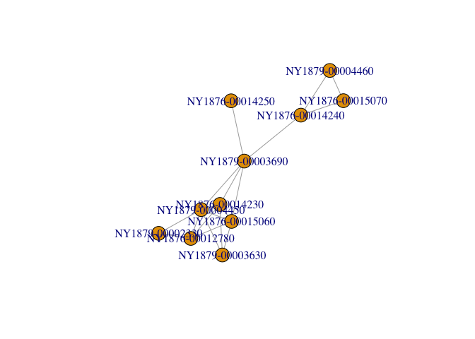

# Clustering
Lincoln Mullen  
September 25, 2015  


```r
library("readr")
library("dplyr")
library("igraph")
```

How are all of the sections related to one another? We can think of this as a network problem. Sections that are similar have a relationship, but are very unlikely to have relationships to every other section. So we can use our comparisons then decompose that big network graph into families of codes.

Read the data.


```r
comparisons <- read_csv("out/scores-all-sections-pairs.csv") %>% 
  select(-dissimilarity) %>% 
  rename(weight = similarity) %>% 
  filter(weight > 0.1)
```


```r
g <- graph.data.frame(comparisons, directed = "FALSE")
families <- decompose(g, min.vertices = 2)
num_sections <- vapply(families, function(x) { length(V(x))}, integer(1))
head(sort(-num_sections), 20)
```

```
##  [1] -18213   -546   -411   -255   -159   -123   -121   -115    -81    -76
## [11]    -70    -56    -56    -55    -53    -53    -48    -46    -46    -43
```

```r
which(num_sections > 10 & num_sections < 15)
```

```
##   [1]    4    7   47  107  209  212  244  331  344  346  348  362  363  447
##  [15]  460  498  504  518  528  542  556  580  581  586  625  672  677  678
##  [29]  679  682  697  706  710  711  723  724  736  744  747  752  760  767
##  [43]  773  806  821  823  836  839  840  871  890  938  939  942  971  975
##  [57] 1084 1089 1095 1096 1141 1419 1421 1481 1546 1547 1607 1689 1735 1761
##  [71] 1794 1811 1838 1848 1850 1852 1855 1856 1891 2160 2172 2290 2355 2381
##  [85] 2390 2392 2408 2482 2557 2563 2564 2701 2717 2825 2826 2856 2858 3034
##  [99] 3037 3080 3085 3209 3428 3452 3459 3461 3471 3472 3493 3996 4042 4116
## [113] 4125 4137 4635
```

Plot those and look at their vertices.


```r
V(families[[4]])
```

```
## + 13/13 vertices, named:
##  [1] AK1900-00000320 AL1852-00000240 DC1857-00000710 IA1851-00001560
##  [5] IA1859-00000810 ID1881-00001380 IN1852-00000180 MT1895-00003190
##  [9] NE1857-00000970 NY1850-00007100 OR1854-00000260 UT1859-00000610
## [13] TN1858-00001190
```

```r
plot(families[[4]])
```

 

```r
V(families[[1084]])
```

```
## + 12/12 vertices, named:
##  [1] CA1872-00000810 IA1851-00000760 IA1851-00000770 IA1859-00000450
##  [5] ID1881-00000920 ID1881-00000960 IN1852-00004880 MN1851-00004020
##  [9] NY1850-00006000 NY1853-00004380 OR1862-00011540 MT1895-00002120
```

```r
plot(families[[1084]])
```

 

```r
V(families[[4635]])
```

```
## + 11/11 vertices, named:
##  [1] NY1876-00012780 NY1876-00014230 NY1876-00014240 NY1876-00014250
##  [5] NY1876-00015060 NY1876-00015070 NY1879-00002330 NY1879-00003630
##  [9] NY1879-00003690 NY1879-00004450 NY1879-00004460
```

```r
plot(families[[4635]])
```

 

