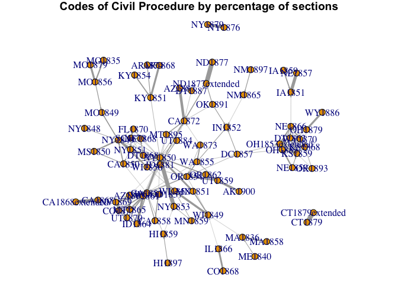

# Network of all codes based on sections borrowed
Lincoln Mullen  
September 26, 2015  

Earlier we made a network graph of all codes using ratio of matches in a code to code comparison. Now lets make a network graph based on sections borrowed.


```r
library("readr")
library("igraph")
library("dplyr")
library("textreuse")
library("stringr")
source("R/best-section-matches.R")
source("R/summarize-borrowings.R")
source("R/extract-date.R")
source("R/extract_code_names.R")
```

Read the data.


```r
borrowings <- read_csv("out/scores-all-sections-pairs.csv") %>% 
  rename(section_a = a, section_b = b) %>% 
  mutate(code_a = extract_code_names(section_a),
         code_b = extract_code_names(section_b),
         year_a = extract_date(code_a),
         year_b = extract_date(code_b))
borrowings
```

```
## Source: local data frame [227,579 x 8]
## 
##          section_a       section_b similarity dissimilarity code_a code_b
##              (chr)           (chr)      (dbl)         (dbl)  (chr)  (chr)
## 1  AK1900-00000020 CA1872-00000860  0.2625000      0.737500 AK1900 CA1872
## 2  AK1900-00000020 DC1857-00003280  0.1369860      0.863014 AK1900 DC1857
## 3  AK1900-00000020 DT1868-00000360  0.0781250      0.921875 AK1900 DT1868
## 4  AK1900-00000020 DT1868-00000370  0.2692310      0.730769 AK1900 DT1868
## 5  AK1900-00000020 DT1887-00000700  0.3125000      0.687500 AK1900 DT1887
## 6  AK1900-00000020 KS1859-00000140  0.1842110      0.815789 AK1900 KS1859
## 7  AK1900-00000020 KS1868-00000160  0.0601504      0.939850 AK1900 KS1868
## 8  AK1900-00000020 KY1851-00000160  0.1571430      0.842857 AK1900 KY1851
## 9  AK1900-00000020 MN1851-00000040  0.1184210      0.881579 AK1900 MN1851
## 10 AK1900-00000020 MO1849-00000090  0.0823529      0.917647 AK1900 MO1849
## ..             ...             ...        ...           ...    ...    ...
## Variables not shown: year_a (int), year_b (int)
```

All the codes in our corpus. Which codes aren't included?


```r
codes <- c(borrowings$code_a, borrowings$code_b) %>% unique
all_codes <- Sys.glob("legal-codes/*") %>% 
  str_replace("legal-codes/", "") %>% 
  str_replace("\\.txt", "") %>% 
  extract_code_names()
setdiff(all_codes, codes)
```

```
## [1] "BI1859"       "FR1806"       "GB1854"       "GB1873"      
## [5] "GB1875"       "LA1825french" "LC1867french" "VA1841"
```

All the codes that aren't included are plausibly not connected to the corpus.

Calculate section matches and summarize them for a single code.


```r
CA1851 <- best_section_matches("CA1851", scores = borrowings, threshold = 0.2)
CA1851
```

```
## Source: local data frame [819 x 6]
## 
##       all_sections match_code   match_section similarity dissimilarity
##              (chr)      (chr)           (chr)      (dbl)         (dbl)
## 1  CA1851-00000010     CA1850 CA1850-00000010   0.224138      0.775862
## 2  CA1851-00000020     NY1849 NY1849-00000630   0.333333      0.666667
## 3  CA1851-00000030         NA              NA         NA            NA
## 4  CA1851-00000040     CA1850 CA1850-00000040   1.000000      0.000000
## 5  CA1851-00000050     CA1850 CA1850-00000070   1.000000      0.000000
## 6  CA1851-00000060     CA1850 CA1850-00000090   0.619048      0.380952
## 7  CA1851-00000070     CA1850 CA1850-00000100   0.815385      0.184615
## 8  CA1851-00000080     NY1850 NY1850-00007050   0.500000      0.500000
## 9  CA1851-00000090     CA1850 CA1850-00000120   0.607843      0.392157
## 10 CA1851-00000100     NY1850 NY1850-00007070   0.461538      0.538462
## ..             ...        ...             ...        ...           ...
## Variables not shown: original_code (chr)
```

```r
summarize_borrowings(CA1851)
```

```
## Source: local data frame [9 x 5]
## 
##   original_code match_code mean_similarity     n percentage_sections
##           (chr)      (chr)           (dbl) (int)               (dbl)
## 1            NA         NA              NA   408         0.498168498
## 2        CA1851     NY1850       0.4990981   302         0.368742369
## 3        CA1851     CA1850       0.5198949    51         0.062271062
## 4        CA1851     NY1849       0.4955549    19         0.023199023
## 5        CA1851     NY1851       0.4554329    12         0.014652015
## 6        CA1851     KY1851       0.4579496    10         0.012210012
## 7        CA1851     MN1851       0.5098427    10         0.012210012
## 8        CA1851     MO1849       0.5832048     4         0.004884005
## 9        CA1851     NY1848       0.5146467     3         0.003663004
```

Apply that to all the codes.


```r
section_pct <- codes %>% 
  lapply(best_section_matches, scores = borrowings, threshold = 0.2) %>% 
  lapply(summarize_borrowings) %>% 
  bind_rows()
section_pct
```

```
## Source: local data frame [1,667 x 5]
## 
##    original_code match_code mean_similarity     n percentage_sections
##            (chr)      (chr)           (dbl) (int)               (dbl)
## 1         AK1900     OR1862       0.4719617   562         0.483233018
## 2             NA         NA              NA   362         0.311263972
## 3         AK1900     NY1850       0.5110468    48         0.041272571
## 4         AK1900     OR1854       0.5342150    30         0.025795357
## 5         AK1900     UT1859       0.6176495    20         0.017196905
## 6         AK1900     SC1870       0.5974885    14         0.012037833
## 7         AK1900     NY1853       0.5341055    12         0.010318143
## 8         AK1900     CA1851       0.6132625    11         0.009458298
## 9         AK1900     MT1895       0.4724611    11         0.009458298
## 10        AK1900     AZ1865       0.5037463     9         0.007738607
## ..           ...        ...             ...   ...                 ...
```

Do some filtering and munge into an edge list.


```r
edges <- section_pct %>% 
  filter(percentage_sections >= 0.05,
         !is.na(match_code)) %>% 
  select(original_code, match_code, weight = percentage_sections)
edges
```

```
## Source: local data frame [180 x 3]
## 
##    original_code match_code     weight
##            (chr)      (chr)      (dbl)
## 1         AK1900     OR1862 0.48323302
## 2         AR1868     KY1851 0.41046278
## 3         AR1874     AR1868 0.25145068
## 4         AR1874     KY1851 0.15087041
## 5         AZ1865     CA1851 0.47688243
## 6         AZ1865     NV1861 0.20343461
## 7         AZ1865     MT1865 0.07529723
## 8         AZ1887     CA1872 0.54661792
## 9         AZ1887     DT1887 0.05850091
## 10        CA1850     NY1850 0.23584906
## ..           ...        ...        ...
```

Turn that into a graph.


```r
g <- graph.data.frame(edges, directed = TRUE)
set.seed(4821)
l <- layout.fruchterman.reingold(g, weights = E(g)$weight)
par(mar = c(0,0,1,0))
plot(g, edge.width = E(g)$weight * 8, layout = l,
     edge.arrow.size = 0.15, vertex.size = 5)
title("Codes of Civil Procedure by percentage of sections")
```

 
