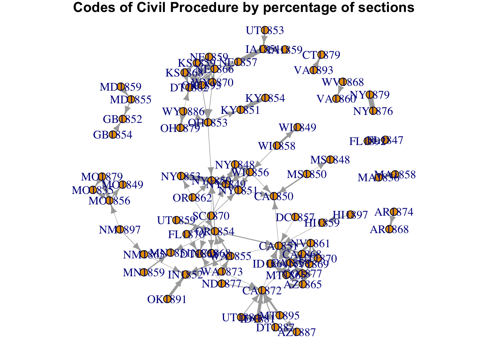

    library("readr")
    library("igraph")
    library("dplyr")
    library("stringr")
    library("parallel")
    library("textreuse")
    source("R/best-section-matches.R")
    source("R/summarize-borrowings.R")
    source("R/extract-date.R")
    source("R/extract_code_names.R")
    options("mc.cores" = 6L)

Read the data.

    cache_corpus <- "cache/corpus-sections-minash-n120-seed623.rda"
    load(file = cache_corpus)
    cache_lsh <- "cache/lsh-sections.rda"
    load(file = cache_lsh)
    borrowings <- section_scores %>% 
      rename(section_a = a, section_b = b, similarity = score) %>% 
      mutate(dissimilarity = 1 - similarity,
             code_a = extract_code_names(section_a),
             code_b = extract_code_names(section_b),
             year_a = extract_date(code_a),
             year_b = extract_date(code_b))
    codes <- c(borrowings$code_a, borrowings$code_b) %>% unique()

Calculate section matches and summarize them for a single code.

    CA1851 <- best_section_matches("CA1851", borrowings, threshold = 0.2)
    CA1851

    ## Source: local data frame [761 x 6]
    ## 
    ##     all_sections match_code match_section similarity dissimilarity
    ##            (chr)      (chr)         (chr)      (dbl)         (dbl)
    ## 1  CA1851-000010     CA1850 CA1850-000010  0.2857143    0.71428571
    ## 2  CA1851-000020     NY1849 NY1849-000870  0.3333333    0.66666667
    ## 3  CA1851-000030         NA            NA         NA            NA
    ## 4  CA1851-000040     CA1850 CA1850-000040  1.0000000    0.00000000
    ## 5  CA1851-000050     CA1850 CA1850-000070  0.9583333    0.04166667
    ## 6  CA1851-000060     CA1850 CA1850-000090  0.5652174    0.43478261
    ## 7  CA1851-000070     NY1851 NY1851-001370  0.8181818    0.18181818
    ## 8  CA1851-000080     NY1850 NY1850-006570  0.4827586    0.51724138
    ## 9  CA1851-000090     CA1850 CA1850-000120  0.7500000    0.25000000
    ## 10 CA1851-000100     NY1850 NY1850-006590  0.4285714    0.57142857
    ## ..           ...        ...           ...        ...           ...
    ## Variables not shown: original_code (chr)

    summarize_borrowings(CA1851)

    ## Source: local data frame [10 x 5]
    ## 
    ##    original_code match_code mean_similarity     n percentage_sections
    ##            (chr)      (chr)           (dbl) (int)               (dbl)
    ## 1             NA         NA              NA   314         0.412614980
    ## 2         CA1851     NY1850       0.4924215   301         0.395532194
    ## 3         CA1851     CA1850       0.5066487    53         0.069645204
    ## 4         CA1851     NY1851       0.5650909    28         0.036793693
    ## 5         CA1851     NY1849       0.5247201    23         0.030223390
    ## 6         CA1851     MN1851       0.5214114    19         0.024967148
    ## 7         CA1851     NY1848       0.4821353    12         0.015768725
    ## 8         CA1851     KY1851       0.5563984     6         0.007884363
    ## 9         CA1851     MO1849       0.5906650     3         0.003942181
    ## 10        CA1851     IA1851       0.2497914     2         0.002628121

Apply that to all the codes.

    section_pct <- codes %>% 
      mclapply(best_section_matches, scores = borrowings, threshold = 0.2)  %>% 
      mclapply(summarize_borrowings) %>% 
      bind_rows()
    section_pct

    ## Source: local data frame [2,297 x 5]
    ## 
    ##    original_code match_code mean_similarity     n percentage_sections
    ##            (chr)      (chr)           (dbl) (int)               (dbl)
    ## 1         AK1900     OR1862       0.4901537   674         0.496318115
    ## 2             NA         NA              NA   342         0.251840943
    ## 3         AK1900     NY1850       0.5638917    39         0.028718704
    ## 4         AK1900     OR1854       0.4928835    28         0.020618557
    ## 5         AK1900     UT1859       0.6065792    19         0.013991163
    ## 6         AK1900     CA1872       0.5736540    15         0.011045655
    ## 7         AK1900     AZ1865       0.5474089    14         0.010309278
    ## 8         AK1900     MN1859       0.5792404    14         0.010309278
    ## 9         AK1900     CA1851       0.5646568    13         0.009572901
    ## 10        AK1900     NV1869       0.4924526    13         0.009572901
    ## ..           ...        ...             ...   ...                 ...

Do some filtering and munge into an edge list.

    # Note that original code is a misnomer here
    edges <- section_pct %>% 
      mutate(original_date = extract_date(original_code),
             match_date = extract_date(match_code)) %>% 
      filter(percentage_sections >= 0.05,
             !is.na(match_code),
             original_code >= match_code) %>% 
      select(original_code, match_code, weight = percentage_sections)
    edges

    ## Source: local data frame [130 x 3]
    ## 
    ##    original_code match_code     weight
    ##            (chr)      (chr)      (dbl)
    ## 1         AR1874     AR1868 0.32072617
    ## 2         CA1851     CA1850 0.06964520
    ## 3         CA1858     CA1851 0.75866667
    ## 4         CA1868     CA1858 0.31939163
    ## 5         CA1868     CA1851 0.24904943
    ## 6         CA1868     AZ1865 0.07319392
    ## 7         CA1872     CA1858 0.07155172
    ## 8         CA1872     CA1851 0.05818966
    ## 9         CA1872     AZ1865 0.05043103
    ## 10        CO1877     CA1858 0.13435897
    ## ..           ...        ...        ...

Turn that into a graph.

    g <- graph_from_data_frame(edges, directed = TRUE)
    set.seed(4821)
    l <- layout.fruchterman.reingold(g, weights = E(g)$weight)
    par(mar = c(0,0,1,0))
    plot(g, edge.width = E(g)$weight * 8, layout = l,
         edge.arrow.size = 0.65, vertex.size = 5)
    title("Codes of Civil Procedure by percentage of sections")

