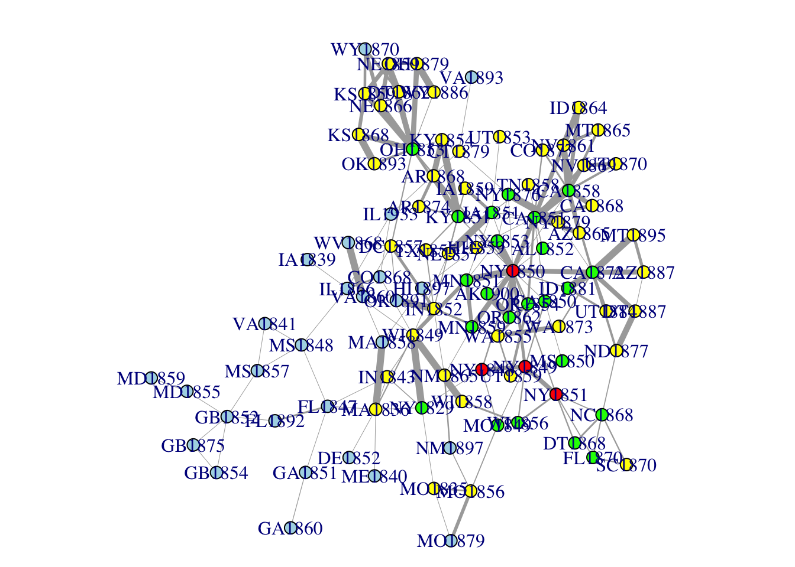
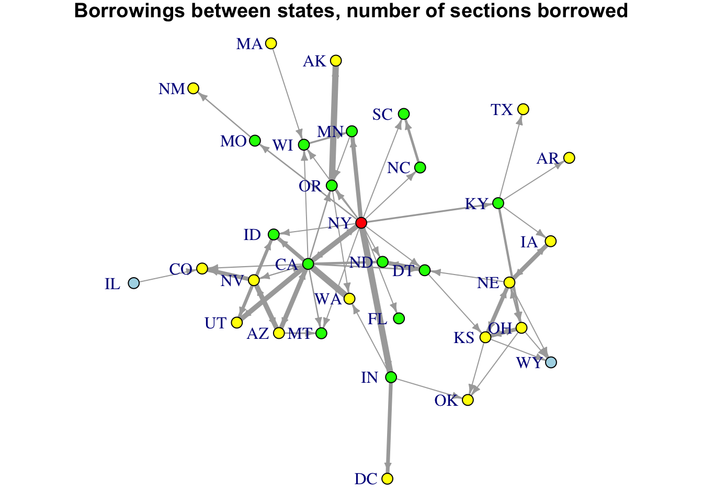

    library("readr")
    library("igraph")
    library("dplyr")
    library("stringr")
    library("parallel")
    library("scales")
    library("textreuse")
    source("R/best-section-matches.R")
    source("R/summarize-borrowings.R")
    source("R/extract-date.R")
    source("R/extract_code_names.R")
    source("R/extract-state.R")
    options("mc.cores" = 6L)

Read the data.

    load("cache/corpus-lsh.rda")
    codes <- c(scores$code_a, scores$code_b) %>% unique()

Calculate section matches and summarize them for a single code.

    CA1851 <- best_section_matches("CA1851", scores, threshold = 0.15)
    CA1851

    ## Source: local data frame [762 x 5]
    ## 
    ##     all_sections match_code match_section similarity borrower_code
    ##            (chr)      (chr)         (chr)      (dbl)         (chr)
    ## 1  CA1851-000010     CA1850 CA1850-000010  0.2857143        CA1851
    ## 2  CA1851-000020     NY1849 NY1849-000870  0.3333333        CA1851
    ## 3  CA1851-000030         NA            NA         NA            NA
    ## 4  CA1851-000040     CA1850 CA1850-000040  1.0000000        CA1851
    ## 5  CA1851-000050     CA1850 CA1850-000070  0.9583333        CA1851
    ## 6  CA1851-000060     CA1850 CA1850-000090  0.5652174        CA1851
    ## 7  CA1851-000070     NY1851 NY1851-001370  0.8181818        CA1851
    ## 8  CA1851-000080     NY1850 NY1850-006570  0.4827586        CA1851
    ## 9  CA1851-000090     CA1850 CA1850-000120  0.7500000        CA1851
    ## 10 CA1851-000100     NY1850 NY1850-006590  0.4285714        CA1851
    ## ..           ...        ...           ...        ...           ...

    summarize_borrowings(CA1851)

    ## Source: local data frame [11 x 5]
    ## 
    ##    borrower_code match_code mean_similarity     n percentage_sections
    ##            (chr)      (chr)           (dbl) (int)               (dbl)
    ## 1         CA1851     NY1850       0.4660118   328         0.430446194
    ## 2             NA         NA              NA   276         0.362204724
    ## 3         CA1851     CA1850       0.4887438    56         0.073490814
    ## 4         CA1851     NY1851       0.5650909    28         0.036745407
    ## 5         CA1851     MN1851       0.4593559    23         0.030183727
    ## 6         CA1851     NY1849       0.5247201    23         0.030183727
    ## 7         CA1851     NY1848       0.4383638    14         0.018372703
    ## 8         CA1851     KY1851       0.4657729     8         0.010498688
    ## 9         CA1851     MO1849       0.5906650     3         0.003937008
    ## 10        CA1851     IA1851       0.2497914     2         0.002624672
    ## 11        CA1851     NY1829       0.3548387     1         0.001312336

Apply that to all the codes.

    code_match_summary <- codes %>% 
      mclapply(best_section_matches, scores = scores, threshold = 0.15)  %>% 
      mclapply(summarize_borrowings) %>% 
      bind_rows()
    code_match_summary

    ## Source: local data frame [2,416 x 5]
    ## 
    ##    borrower_code match_code mean_similarity     n percentage_sections
    ##            (chr)      (chr)           (dbl) (int)               (dbl)
    ## 1         AK1900     OR1862       0.4774350   703          0.51388889
    ## 2             NA         NA              NA   306          0.22368421
    ## 3         AK1900     NY1850       0.5537188    40          0.02923977
    ## 4         AK1900     OR1854       0.4820767    29          0.02119883
    ## 5         AK1900     UT1859       0.5858656    20          0.01461988
    ## 6         AK1900     CA1872       0.5244765    17          0.01242690
    ## 7         AK1900     MN1859       0.5513771    15          0.01096491
    ## 8         AK1900     AZ1865       0.5474089    14          0.01023392
    ## 9         AK1900     SC1870       0.5665364    14          0.01023392
    ## 10        AK1900     WA1855       0.5221759    14          0.01023392
    ## ..           ...        ...             ...   ...                 ...

Create a network graph based on section percentages.

    edges_pct <-
      code_match_summary %>% 
      mutate(borrower_date = extract_date(borrower_code),
             match_date = extract_date(match_code)) %>% 
      filter(percentage_sections >= 0.05,
             !is.na(match_code),
             borrower_date >= match_date) %>% 
      select(borrower_code, match_code, weight = percentage_sections) %>% 
      group_by(borrower_code) %>% 
      top_n(2, weight)
    edges_pct

    ## Source: local data frame [131 x 3]
    ## Groups: borrower_code [77]
    ## 
    ##    borrower_code match_code    weight
    ##            (chr)      (chr)     (dbl)
    ## 1         AK1900     OR1862 0.5138889
    ## 2         AR1868     KY1854 0.3190513
    ## 3         AR1868     KY1851 0.3029839
    ## 4         AR1874     AR1868 0.3282905
    ## 5         AR1874     KY1851 0.1709531
    ## 6         AZ1865     CA1851 0.3349191
    ## 7         AZ1865     CA1858 0.3073264
    ## 8         AZ1887     CA1872 0.3716632
    ## 9         CA1850     NY1849 0.2687861
    ## 10        CA1850     NY1850 0.1416185
    ## ..           ...        ...       ...

    g <- graph_from_data_frame(edges_pct, directed = TRUE) 
    nodes <- distances(g, to = "NY1850", algorithm = "unweighted") %>% as.data.frame() %>% 
      add_rownames() %>% 
      rename(name = rowname, distance = NY1850) %>% 
      mutate(color = ifelse(distance == 0, "red",
                            ifelse(distance == 1, "green",
                                   ifelse(distance == 2, "yellow", "lightblue"))))

    ## Warning in distances(g, to = "NY1850", algorithm = "unweighted"):
    ## Unweighted algorithm chosen, weights ignored

    nodes[nodes$name == "NY1848", "color"] <- "red"
    nodes[nodes$name == "NY1849", "color"] <- "red"
    nodes[nodes$name == "NY1850", "color"] <- "red"
    nodes[nodes$name == "NY1851", "color"] <- "red"
    g <- graph_from_data_frame(edges_pct, directed = TRUE, vertices = nodes) 
    V(g)$year <- V(g)$name %>% extract_date()
    set.seed(4221)

    g <- add_layout_(g, with_graphopt(niter = 4000, spring.length = 25), normalize())

    plot_before_year <- function(x, year) {
      x_before <- induced.subgraph(x, which(V(x)$year <= year))
      n <- V(x)$name
      n_before <- V(x_before)$name
      filter <- n %in% n_before
      x_before$layout <- x_before$layout[filter, ]
      par(mar = c(0,0,1,0))
      plot(x_before, edge.width = E(x_before)$weight * 8,
           edge.arrow.size = 0.0, vertex.size = 5)
      title(paste0("Codes of Civil Procedure before ", year))
    } 

    for (i in seq(1850, 1900, 5)) {
      png(filename = paste0("out/field-code-network-ALL", i, ".png"), width = 1200,
          height = 900)
      plot_before_year(g, i)
      dev.off()
    }

Create a graph based on numbers (not percentages) of sections shared.
Notice that we are keeping only code to code matches that share a
certain number of sections (`minimum_n`), we are keeping only a certain
number of matches for each code (`top_matches`), and we are omitting
codes that aren't part of the main network.

    minimum_n <- 20
    top_matches <- 3
    codes_not_to_plot <- c(
      # "CO868", 
    #   "CT1879", 
      # "FL1847", 
      # "FL1892", 
      "GA1851",
      "GA1860", 
      "HI1859", 
      "HI1897", 
      # "IL1866", 
      "LA1825", 
      "LA1844", 
    #   "MS1848", 
    #   "MS1857", 
      # "NY1876", 
      # "NY1879",
      # "VA1860", 
      "VA1893", 
      "WV1868" 
      )
    # codes_not_to_plot <- NULL

    edges_n <- code_match_summary %>% 
      mutate(borrower_date = extract_date(borrower_code),
             match_date = extract_date(match_code)) %>% 
      filter(!is.na(match_code),
             borrower_date >= match_date,
             n >= minimum_n) %>%  
      select(borrower_code, match_code, weight = n) %>% 
      group_by(borrower_code) %>% 
      top_n(top_matches, weight) %>% 
      ungroup() %>% 
      mutate(weight = rescale(weight)) %>% 
      filter(!borrower_code %in% codes_not_to_plot,
             !match_code %in% codes_not_to_plot)
    edges_n

    ## Source: local data frame [197 x 3]
    ## 
    ##    borrower_code match_code      weight
    ##            (chr)      (chr)       (dbl)
    ## 1         AK1900     OR1862 0.401885681
    ## 2         AK1900     NY1850 0.011196229
    ## 3         AK1900     OR1854 0.004714202
    ## 4         AR1868     KY1854 0.233352976
    ## 5         AR1868     KY1851 0.220978197
    ## 6         AR1868     OH1853 0.007660577
    ## 7         AR1874     AR1868 0.115497938
    ## 8         AR1874     KY1851 0.054213318
    ## 9         AR1874     KY1854 0.038302887
    ## 10        AZ1865     CA1851 0.195050088
    ## ..           ...        ...         ...

    g_n <- graph_from_data_frame(edges_n, directed = TRUE) 
    node_distances <- distances(g_n, to = c("NY1848", "NY1849", "NY1850", "NY1851"),
                         algorithm = "unweighted") %>% 
                         apply(1, min, na.rm = TRUE)

    ## Warning in distances(g_n, to = c("NY1848", "NY1849", "NY1850", "NY1851"), :
    ## Unweighted algorithm chosen, weights ignored

    nodes_n <- data_frame(name = names(node_distances), distance = node_distances) %>% 
      mutate(color = ifelse(distance == 0, "red",
                            ifelse(distance == 1, "green",
                                   ifelse(distance == 2, "yellow", "lightblue"))))

    g_n <- graph_from_data_frame(edges_n, directed = TRUE, vertices = nodes_n) 
    V(g_n)$year <- V(g_n)$name %>% extract_date()

    edge_size_clamp <- function(g, multiplier = 20, max_val = 6, min_val = 1) {
      w <- E(g)$weight * multiplier
      w[w > max_val] <- max_val
      w[w < min_val] <- min_val
      w
    }

    set.seed(4221)
    g_n <- g_n %>% add_layout_(with_graphopt(niter = 4000, spring.length = 25),
                               normalize())
    par(mar = c(0,0,1,0))
    plot(g_n, edge.width = edge_size_clamp(g_n), edge.arrow.size = 0, vertex.size = 5)
    title("Borrowings between codes, number of sections borrowed")

Now do a state to state network:

    min_state_borrowings <- 100
    top_matches <- 3
    edges_states <- code_match_summary %>% 
      mutate(borrower_date = extract_date(borrower_code),
             match_date = extract_date(match_code),
             borrower_state = extract_state(borrower_code),
             match_state = extract_state(match_code)) %>% 
      filter(!is.na(match_code),
             borrower_date >= match_date,
             borrower_state != match_state) %>% 
      group_by(borrower_state, match_state) %>% 
      summarize(n = sum(n)) %>% 
      filter(n >= min_state_borrowings) %>% 
      select(borrower_state, match_state, weight = n) %>% 
      group_by(borrower_state) %>% 
      top_n(top_matches, weight) %>% 
      ungroup() %>% 
      mutate(weight = rescale(weight))

    edges_states

    ## Source: local data frame [68 x 3]
    ## 
    ##    borrower_state match_state     weight
    ##             (chr)       (chr)      (dbl)
    ## 1              AK          OR 0.50000000
    ## 2              AR          KY 0.72222222
    ## 3              AZ          CA 0.78253968
    ## 4              AZ          NV 0.05079365
    ## 5              CA          AZ 0.07619048
    ## 6              CA          NV 0.17936508
    ## 7              CA          NY 0.82619048
    ## 8              CO          CA 0.17777778
    ## 9              CO          IL 0.03412698
    ## 10             CO          NV 0.05555556
    ## ..            ...         ...        ...

    g_states <- graph_from_data_frame(edges_states, directed = TRUE)

    state_distances <- distances(g_states, to = "NY", algorithm = "unweighted") 

    ## Warning in distances(g_states, to = "NY", algorithm = "unweighted"):
    ## Unweighted algorithm chosen, weights ignored

    nodes_states <- data_frame(name = rownames(state_distances),
                               distance = state_distances[, 1]) %>% 
      mutate(color = ifelse(distance == 0, "red",
                            ifelse(distance == 1, "green",
                                   ifelse(distance == 2, "yellow", "lightblue"))))

    g_states <- graph_from_data_frame(edges_states, directed = TRUE,
                                      vertices = nodes_states) %>% 
      decompose(min.vertices = 3) %>% 
      `[[`(1)

    set.seed(4221)
    g_states <- g_states %>% add_layout_(with_graphopt(niter = 4000,
                                                       spring.length = 25),
                                         normalize())
    par(mar = c(0,0,1,0))
    plot(g_states, 
         edge.width = edge_size_clamp(g_n), edge.arrow.size = 0.5,
         edge.arrow.mode = 1,
         vertex.size = 5, vertex.label.dist = 0.85, vertex.label.degree = pi)
    title("Borrowings between states, number of sections borrowed")

