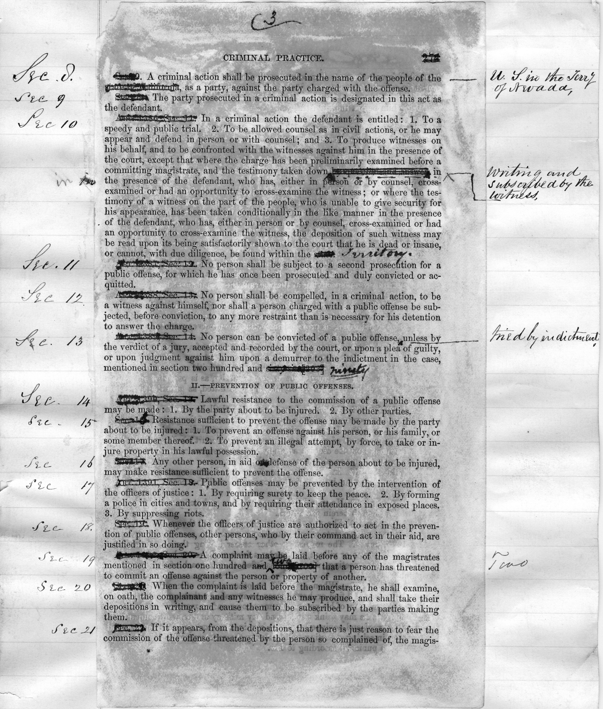

---
author:
- Kellen Funk
- Lincoln Mullen
fontfamily:
- mathpazo
fontsize: 12pt
output:
  pdf_document:
    fig_caption: True
    md_extensions: '-tex_math_single_backslash'
    number_sections: False
  word_document: 
    fig_caption: True
    md_extensions: '-tex_math_single_backslash'
    pandoc_args: ["--smart"]
title: The Spine of American Legal Practice
---

```{r setup, include=FALSE} 
knitr::opts_chunk$set(echo = FALSE, message = FALSE, warning = FALSE)
library(dplyr)
library(igraph)
library(ggplot2)
library(ggraph)
library(stringr)
library(scales)
library(textreuse)
source("../R/helper.R")
source("../R/section-matches.R")
source("../R/spectrogram.R")
load("../cache/corpus-lsh.rda")
load("../cache/network-graphs.rda")
set.seed(82893)
```

At the opening of the first Nevada legislature in 1861, Territorial Governor James W. Nye, a former New York lawyer, instructed the assembly that they would have to forsake their inherited Mormon statutes that were ill adapted to "the mining interests" of the new territory. "Happily for us, a neighboring State whose interests are similar to ours, has established a code of laws" sufficiently attractive to "capital from abroad." That neighbor was California, and Nye urged that California's "Practice Code" be enacted in Nevada, as far as it could "be made applicable."[^1] Territorial Senator William Morris Stewart, a famed mining lawyer who would lead the U.S. Senate during Reconstruction, followed the instructions perhaps too well. Stewart literally cut and pasted the latest *Wood's Digest* of the California Practice Act into the session bill, crossing out *state* and *California* and substituting *territory* and *Nevada* where necessary. Stewart copied not just California's procedure code but also its method of codification, for California had in turn borrowed its code by modifying New York's.



Nye wrote back to the assembly in disgust. The bill---of 715 sections---had reached him late the night before the legislative session was to close. Even in the few hours he had to read it, Nye counted "many errors in the enrolling of it, numbering probably more than three hundred." Some errors were severe. The code overwrote the specific jurisdictional boundaries of Nevada’s Organic Act by copying California’s arrangements. Error-riddled and unconstitutional as the bill was, Nye believed a civil practice code was a "universal necessity and public need," doubting "whether your courts would be able to fulfill the purpose of their creation" without one.[^2] Nye signed the code into law.

Nothing like this "universal necessity" existed when Nye began his legal career in New York in the 1840s; rather, it was one of the central developments of America law after the mid-nineteenth century. By 1900, thirty-one American states and territories had adapted the text of a New York code of civil procedure first promulgated in 1848. The code became known as the Field Code, after its chief draftsman David Dudley Field, a Manhattan trial lawyer.[^3] When Field's code appeared in the Colorado assembly in 1876, a Denver newspaper wryly commented, "The scissors and paste-pot we had heretofore confidently believed were implements peculiar to the newspaper sanctum." To the editor, the cut-and-paste code was not just a curiosity of legislative history. Rather, the extensive copying of Field's Code threatened the foundations of American popular sovereignty. "The bill is a long one; the assembly has not the time to devote to it and to give it the scrutiny that a measure of such importance demands.” Blind approval "would be an injustice to themselves and a greater wrong and injustice to the people who have a right to demand that their public servants legislate for the public good." The code "has been 'assimilated,' as we are informed, 'to the character and requirements of our people,' whatever that may mean," but the editor feared the legislation was the product of "men who have the welfare of the 'dear people' at their tongue's end always, but never in their hearts."[^4]

The migration of the Field Code was a central event in Anglo-American legal history, but no historian has traced the extensive borrowings of the Field text nor recognized the political furor that greeted the code outside New York.[^5] Every aspect of a civil justice system, from the rules granting access to courts, to lawyers, to remedies (whether damages, injunctions, or seizure of property) was covered by the code, making its New York-specific rules politically contentious both inside and outside the Empire State. As the Field Code migrated around the country, commentators in each jurisdiction raised the same complaint: how could legislation borrowed from another state represent the popular will and best interests of *this* state?

Understanding the history of the Field Code requires not only attention to its political context but also a detailed examination of the substance of what was borrowed and what was revised in each jurisdiction. Exploring these borrowings is a daunting task, however. Procedure codes were long, technical documents, and although each jurisdiction copied large swaths of text, each also modified the text along the way, sometimes with a simple *Nevada* for *California*, sometimes with more foundational changes to civil remedies. Although Stewart's cut-and-paste code found its way into the archives, most draft legislation did not, and few codifiers explained in detail how they produced their texts. Traditional close reading or textual criticism of some 98,000 distinct sections of law across 20,000 pages comprising 7.7 million words is simply not a feasible research task for a historian who wishes to track these borrowings.

Yet by turning to the digital analysis of texts, we have resolved this difficulty and tracked how states borrowed their codes of civil practice from one another. Within the corpus of legislation, algorithmic analysis of texts can reverse engineer and visualize what the archive revealed in figure 1: which texts were borrowed, which modified, and how extensively. Our method works especially well for legal texts, for reasons we will explain. However, scholars can extend this method to other curated collections of texts, from church hymns to medical treatises.

The first contribution of this article is to demonstrate our methods as applied to a corpus of nineteenth-century civil procedure codes. The second contribution is to integrate what we learned from the text analysis with the more conventional approaches of political and cultural history to explain why the migration of the Field Code mattered. On the national level the extent of legislative borrowing followed a pattern American historians have described as a "Greater Reconstruction" in which the former Confederate South and the Far West showed a remarkable kinship. Scholars have typically described Greater Reconstruction as a federal development, featuring the creation of national citizenship, a national economy, and a larger federal apparatus centered in Washington, D.C. This article shows that Greater Reconstruction had its state-level dimensions as well. The uniform practice of law and adjudication of civil remedies was not structured by Washington mandates, however, but by the anxiety that New York financial capital would follow only New York civil remedies. At the more local level, our digital computations can trace modifications within code traditions, for instance, the ways western and midwestern codifiers altered New York's law to accommodate hardening conceptions of racial competencies in the civil courts. 

## 1. The origin and political controversies of the Field Code

Until 1848, civil remedies and trial practice in New York were largely governed by common law traditions loosely categorized as "practice and pleadings."[^6] To understand how to file a civil claim or to enforce a judgment, a lawyer had to consult ad hoc statutes from colonial times to the present as well as precedents reported from cases litigated at common law and chancery. By the 1840s, enterprising practitioners had collated these materials into a half dozen marketable treatises, but these remained works of private opinion---no court was bound to agree with the treatise writers as to the weight, relevance, or proper interpretation of a legal statement.[^7] The common law was accordingly known as "unwritten law" despite the proliferation of published texts, because the common law was not precisely determined until a particular case demanded resolution.[^8] Statutes, on the other hand, were "written law," prescribing or reforming the rules even before a case put the precise question in issue. Within the realm of written law, codes were the ultimate statutes.[^9]

Codification is, as Lawrence Friedman has written, "one of the set pieces of American legal history." Law reformers advocated for a codification of the common law from the earliest days of the Republic through the Gilded Age, from Massachusetts down to South Carolina. Efforts ranged from mere compilations of existing statutes in each state to a full European-style codification meant to be an entirely comprehensive and systematic statement of the law.[^10] At its most basic level, codification proposed that legislative policy ought to be the sole source of law. Law was to be made by democratically responsible legislators in terse, unambiguous statements, not discovered through application and analogy in particular cases by the judges. Debates over codification thus ranged from the metaphysics of law to political theories of institutional competency and the separation of powers.[^11]

In New York, these codification debates came to a head at the 1846 constitutional convention, where "the conquerors took all," as the ambivalent Jacksonian James Fenimore Cooper complained.[^12] Law reformers abolished the court of chancery, made judges stand for popular election, and required the legislature to appoint commissioners to codify the law and reform the "practice and pleadings" of the civil courts.[^13] 

New Yorkers had two models of legislative commissions on which they could draw for their own law reforms. The French government under Napoleon had appointed five-member commissions to codify the law of France. When the New York law reformer William Sampson called for codification in a widely noted address to the New York historical society, one of the members of the French commission was living in exile in upstate New York at the time and wrote to Sampson to advise him on the mechanics of codification: "Let four or five good heads be united in a commission, to frame in silence the project of a code. It is not so difficult a task. It is only to consult together, and to select. Do so with your best authors as we did with ours, ... which we simply converted into articles of our code." Tellingly, the French commissioner took it as granted that the commission's code would automatically be promulgated as law.[^14]

The other model came from England. Royal commissions had been employed since before the Revolution of 1688 to advise on a variety of matters. Although by the mid-nineteenth century royal commissions sometimes offered model statutes, Parliament maintained exclusive legislative prerogatives, forcing any commissioner-proposed legislation to pass through the normal politicking and drafting processes of Parliament.[^15]

After David Dudley Field and two other lawyers were appointed to the procedural commission, their reports made clear that they favored the French model but understood political realities would hold them to the English model. From 1847 to 1850, the commissioners made five reports to the legislature knowing they had no power to keep legislators from amending their code or even defeating it altogether. Each time they reminded legislators that "public opinion had issued its mandate in the most imposing form" of a constitutional decree. The constitution, together with the legislative act appointing the commission, "gave the commissioners instructions so precise, as to leave them no discretion, if they had desired it, \[and\] promised them therefore in advance, so long as they obeyed those instructions, the concurrence and co-operation of all departments of the government."[^16] Although the theory of codification made it a democratic enterprise, in practice Jacksonians like Field insisted the democratic legislature ought to defer to the expertise of the commissioners.

The Field commission sought to blunt criticism by insisting that political concerns about lawmaking did not apply to mere procedure. "The system of procedure by which law is administered, differs from the law itself in this," the commissioners explained: "the latter is a body of elementary rules founded in the immutable principles of justice, drawing their origin from the obligations which divine wisdom has imposed ...; while the former consists, in its very nature, but of a body of prescribed rules, having no source but the will of those by whom they are laid down." Substantive law was universal, natural, grounded in divine justice, and therefore entitled to respect and protection from change. But God cared nothing of the "the mere machinery by which law is to be administered." Thus, the commissioners argued, procedure was trivial enough for legislative experimentation but complicated enough that only master practitioners like themselves could run the experiment.[^17]

Yet the code's scope of "procedure" included far more than the "mere machinery" of a lawsuit.[^18] The final draft of the code, printed in 1850, spanned nearly 800 pages of 1,885 regulations. The first third of the code covered constitutional topics, specifying the jurisdiction of all state courts and the duties of all state officers (and liabilities for violating those duties). The code deregulated attorney compensation, introducing novel structures of retainers and contingency fees.[^19] It created summary procedures meant to accelerate debt collection while simultaneously carving out "homestead" exemptions from the sheriff's reach.[^20] The code concluded by defining who could be an attorney, a juror, and a witness, drawing racial and gendered distinctions over who could speak in court.[^21]

Most important, the code defined all the remedies that a civil court could order---from money damages, to partition of property, to injunctive decrees and contempts---and made those remedies available in every lawsuit. In many cases, a legal right was indistinguishable from the remedy that secured that right: the right to possess a particular piece of property and the remedy that seized and delivered that property were, in effect, the same thing. Remedies were thus intimately connected to substantive law. For that reason, neither the French *code de procédure civile* (1806) nor Blackstone or Bentham's writings conceived of remedies as purely procedural.[^22] By codifying remedies, Field invited continual expansion of the category of "procedure." As other states adopted the procedure code, they sometimes included other fields of law that seemed obviously "substantive" yet had such specific procedures or remedies that they were placed in a "code of procedure." Such fields included the law of wills, corporations, and mortgages.[^23] And after all, argued procedural codifiers in Iowa, what did the famed Married Women's Property Acts offer besides procedural reform? These acts gave women *standing* to litigate in their own name and seek *remedies* in claims of property and contract, and they abolished mandatory rules of *joinder* (of husbands). Thus, one of the most significant changes to the law of property and domestic relations in the century went into the state's Code of Civil Procedure.[^24]

Despite Field's arguments that a mere procedure code was democratically unproblematic, his efforts were not entirely successful in New York. The commission submitted a draft of its main reforms in 1848, emphasizing that this first code was "but a report in part." New York's legislators enacted the partial code with little amendment, some legislators repeating Field's view that the constitution obligated them to accept the code.[^25] But when the commissioners submitted an extended draft in 1849, the Assembly judiciary committee balked, directly disputing the commissioners' claims that procedure was merely the machinery of the law. The "provisions for rights and for the mode of pursuing remedies, insensibly run into each other," the committee reported, complicating legal practice "infinitely more than any machine of human contrivance." They therefore suspected the commissioners' forthcoming code of criminal procedure would include all of the criminal law as well, "as they seem to understand practice and pleadings to include all the law upon a given subject." That being the case, the committee wondered whether they should "place in \[the commissioners\] a blind and implicit confidence that shall commit to their discretion the peace and property, the personal liberty and the lives of those who sent *us* here to make laws for them?"[^26]

![This map shows which states adopted codes of civil procedure based on the New York Field Code. The date shown is the date of the first enactment of a procedure code; most states subsequently revised their codes. Note that many southern states and western states came to adopt the Field Code during the Civil War and Reconstruction. By the end of the nineteenth-century, thirty-one jurisdictions (those displayed on the map, plus Alaska) had adopted a version of the Field Code. Data adapted from Charles McGuffey Hepburn, *The Historical Development of Code Pleading in America and England* (1897).](field-code-states-map.jpeg)

The code would encounter similar difficulties in each jurisdiction that adopted it. Even the shortest version of the Field Code was significantly longer than any other state statute before the Progressive legislation of the twentieth century. Unlike statutory compilations that sometimes took the name of a "code" but made no changes to existing law, the Field Code opened by abolishing the hallmarks of prior practice and instituting "hereafter" a new form of action with substantial revisions to basic matters of civil remedies.[^27] In the states where it was imported, there was no getting around the fact that the code introduced much new law, yet legislators were unable to read, critique, and amend the code within the brief period of a legislative session. "It is folly to undertake to pass a code in a sixty day session," wrote the *Montana Post*, "and the best way would be for the Assembly to select one from a State or Territory which would come near meeting our wants, and slide it through with the fewest changes possible."[^28] Sliding the code through eased the problem of time but exacerbated the problem of local sovereignty. "To be governed by a foreign law, especially when that law is not preknown to the people whose conduct is to be regulated thereby ... is something repugnant to the idea of Democratic Republican government," complained the *The Miner's Express* in Iowa.[^29]

How, then, did states and territories achieve a politically acceptable balance between efficiency and sovereignty, borrowing law for sake of time but endowing it with popular legitimacy in each locale? Quite apart from the technicalities of legal practice, the American federation of civil government into (depending on the year) more than thirty or forty separate jurisdictions makes it hard to describe a phenomenon that was truly national despite its state-centered enactments. It requires a sense of how much law was borrowed in each location and to what degree innovations were introduced. But precisely because these questions concern codes---texts that comprehensively and systematically cover a given subject---they are ideal sources for the techniques of digital history.

## 2. Detecting borrowings among procedure codes

To discover how the Field Code migrated to other jurisdictions, we compiled a corpus of potentially relevant laws, including separately bound codes of civil procedure as well as codes or statutes appearing within session laws and statutory compilations from around the Atlantic world. The corpus comprises 135 statutes from the nineteenth century, which amounts to 7.7 million words organized into 98,000 regulations. It includes the initial enactment of every U.S. code of civil procedure, as well as procedure statutes and re-enacted codes from jurisdictions reputed to have been legally influential, including French and British codes. The corpus does not include every nineteenth-century statute of procedural law. While a comprehensive project may be illuminating in its own ways, our specific question of how New York legislation influenced other American jurisdictions permits a more curated corpus.[^30]

Curating a corpus to answer a specific question is an important difference from the way that digital history often describes its work. Speaking in broad terms, digital historical work---like all historical work---can begin either with a set of sources or with a question. Computational digital history is often conceived of as beginning with sources, particularly with large datasets such as the Google Books or Hathi Trust corpora. These large corpora are sometimes called "big data"---though, it must be emphasized, almost never by digital historians who actually work with them---on which "distant reading" can be practiced. While it is salutary for historians to have their research questions shaped by the broadest possible contexts, it is not apparent that digital historians can readily move from these omnibus corpora to answering the specific research questions that animate various historical fields. In this article we demonstrate an alternative approach, which we might unimaginatively label "medium data." The amount of legislation that governed American civil practice is impressive, since every state amended and re-enacted procedure statutes nearly every decade. But while a corpus of procedural legislation requires some computational sophistication, the techniques are far less complex than those derived for truly big data. We have gathered a large but narrowly constrained corpus centered on solving a well-defined research question. This corpus is large enough that digital historical methods provide results that a scholar could not obtain through traditional methods, but sufficiently circumscribed so as to directly address a discipline- and field-specific question.[^31]

Because most codes were public statutes, they were widely printed and distributed and therefore found their way into libraries digitized by Google Books. We drew primarily from the Google Books, filling in gaps from other databases as necessary. We used optical character recognition software (OCR) to create plain-text versions of the codes, which we edited lightly, correcting section markers by hand as necessary and writing a script to fix the most obvious OCR errors.[^32]

The most important step we took in processing the files was to split each section of the code into its own text file. Codes varied in how they were organized, but they all divided specific regulations into *sections* (or, on occasion, *articles*). Not only does the discursive form of these texts provide a handy organizational scheme for digital methods, but historically sections were also the way legislators borrowed their texts. Codifiers took their sources apart by sections, rearranging here, editing, drafting, and then re-combining there. Despite the fact that states differed widely on what topics they included in "civil procedure," sectioning the codes allowed us to assess similarity even among codes of quite different lengths and coverage. For instance, we know that California's 1851 code was derived from New York's 1850 code. (Stephen J. Field, David Dudley's brother, was the lawyer who imported New York's code into California.[^33]) But the New York code is over 150,000 words long, whereas California's code was just over 50,000 words long. Those disparate lengths mean that comparing all of the California code to all of the New York code is less meaningful than comparing each section in the California code to each section in the New York code, where matching sections will have a similar length.

Having divided the texts according to a historically justified pattern, our next step was to compare each section to every other section and measure the similarity between them. To continue the New York-to-California example, consider the following pairs of sections. The first pair is from the final draft of the New York Field Code. These sections completely abolished prior practice and began to rebuild the procedure system from the ground up (figure 3).


In the theory of Euro-American lawyers, California had no prior practice to abolish, so the code began more simply (figure 4).


The pairs are obviously related to one another, both in terms of their legal force and in terms of the actual words used.

A common method for measuring the similarity of two documents involves dividing texts up into tokens of consecutive words (called n-grams) and calculating a Jaccard similarity score, defined as ratio between the number of tokens that the two document have in common to the total number of tokens that appear in both documents. We used five-word tokens and shingled them, meaning that for the New York sections above, the first token was "the distinction between actions at," the second token was "distinction between actions at law," and so on. These tokens each contain more meaning than a single word, yet because they are shingled they are robust to changes in the text or noisy OCR. A Jaccard similarity score will always be in a range between 0 (complete dissimilarity) and 1 (complete similarity).[^34]

Comparing the section pairs above produces the matrix of similarity scores in table 1.

                NY1850-554   NY1850-555   CA1851-001   CA1851-002
  ------------ ------------ ------------ ------------ ------------
  NY1850-554                     0           0.14          0
  NY1850-555                                  0           0.41
  CA1851-001                                               0
  CA1851-002                                          

  : A subset of the section-to-section similarity matrix.

As we would expect the first sections (New York § 554 and California § 1) have a score of 0.14, which indicates that they are similar but have significant differences, while the second sections (New York § 555 to California § 2) have a much higher similarity score of 0.41 since only a few words were changed. Just as important, when we compare the first section in New York to the second section in California, we get a score of 0; the two sections are nothing like each other.

The aim, then, was to create a triangular matrix like the one above, but with approximately 98,000 rows and 98,000 columns, containing the similarity scores for each possible pair of sections. While this is easy enough to conceptualize, such a matrix is actually quite large, containing about 4.8 billion comparisons. This would take an unreasonable amount of computation time, and most of these comparisons would be unnecessary since each section has no relationship to most other sections. We therefore implemented the minhash/locality sensitive hashing algorithm to detect pairs of possible matches quickly. Instead of comparing all tokens to one another, this algorithm samples tokens from each document to find probable matches, and then Jaccard scores can be calculated for only those probable matches (that is, many of the needless calculations that produce scores of zero get cut out).[^35]

The result was a matrix of similarity scores, with over 45,000 genuine matches. For each section in the corpus, after making some adjustments to remove anachronisms and spurious matches, we were able to identify the section from which it was most likely borrowed.[^36] In other words, we had traced the work of the commissioners' scissors and paste-pots through the course of their codes.[^37]

## 3. Patterns of borrowing among Field Code jurisdictions

The computational evidence that we assembled revealed patterns in how law migrated at several different scales of analysis.[^38] We used the similarity matrix as the input to three different digital history techniques: network analysis, visualizations, and clustering.

At the broadest scale of analysis, we aggregated the section-to-section borrowings into a summary of how many sections each code borrowed from each other code. We therefore can show the connections from one code to another. The resulting network graph reveals the genealogy of civil procedure in the United States.

```{r code-to-code-network, fig.width=6.5, fig.height=7, fig.cap = "The structure of borrowings among nineteenth-century codes of civil procedure. Note that several versions of New York's Field Code were at the center of the network, while other states such as California and Ohio became centers of regional variations on the Field Code. States that adopted any of the variations on the Field Code became part of a network centered on New York capital."} 
set.seed(3728)
ggraph(codes_g, "igraph", algorithm = "nicely") +
  geom_edge_fan(aes(edge_width = sections_borrowed, 
                    alpha = sections_borrowed),
                arrow = arrow(type = "closed", ends = "first",
                              length = unit(0.20, "inches"),
                               angle = 15)) + 
  geom_node_point(aes(color = as.factor(distance)), size = 5) +   
  scale_edge_width("Sections borrowed", range = c(1, 2), guide = "none") +    
  scale_edge_alpha(range = c(0.3, 0.6), guide = "none") +   
  scale_color_discrete("Distance from a Field Code") +
  ggforce::theme_no_axes() +  
  geom_node_text(aes(label = name), size = 3, family = "Palatino") +
  labs(title = "The migration of the Field Code",
       subtitle = "Codes of civil procedure connected by borrowed sections") +
  theme(legend.position = "bottom",
        panel.border = element_blank(),
        text = element_text(family = "Palatino"),
        legend.title = element_text(size = 10),
        legend.text = element_text(size = 8),
        plot.title = element_text(face = "bold"))
```

The New York Field Codes, especially the finished draft of 1850, were central to the entire network.[^39] New York gave rise to different regional traditions within the procedural network. Variations in the Field drafts meant that different states could borrow different versions of the Field Code. Field’s 1850 draft---never actually enacted in New York---was the primary progenitor of several families of codes in California, Kentucky, Iowa, and Ohio, each of which in turn became major contributors to the law of neighboring states. The 1851 New York code---a small revision to the original 1848 code---became the progenitor of codes for Wisconsin, Florida, North Carolina, and South Carolina. While Field considered the 1850 version to be the definitive, ideal version of the code, all of the New York codes from 1848 to 1853 became models for other jurisdictions. In many cases, the commissions likely used whatever version of the code they had at hand. The Field Code was not a single volume on the shelf, but a series of drafts, any of which might be more accessible in different regions and in different years.

Even later New York codes can be considered a separate family. In 1876 a New York commission produced a new code attempting to consolidate all the case law and statutory amendments subsequent to the 1851 Field Code. David Dudley Field was upset by the changes introduced in this revision. A count by a "friend" of Field's found that only three sentences of the Field Code had carried over word-for-word into the latest edition. With respect to Mr. Field or his "friend," we found that the connection between the codes somewhat stronger than he thought, although his conclusion that, textually, the 1876 code did "not appear to be the same thing as before," remains sound.[^40]

Finally, our corpus included a number of statutes which stood outside the Field Code tradition, such as Virginia and West Virginia regulations, statutes from Massachusetts and Maine, and southern codes from Georgia to Louisiana. These statutes show that the dominance of the Field Code was not total, and a number of older jurisdictions remained outside of its ambit.[^41] But nearly every jurisdiction established or reconstructed after 1850 became a part of the Field Code network, and no other tradition achieved anywhere near the same coherence across state lines.

In addition to the overview of the relationship between codes, we can also see more detail by visualizing the pattern of borrowings within each code. To illustrate this, we will follow one branch of the Field Code network, beginning with the family started by California's 1850 and 1851 codes.

California's 1850 code, enacted in the period when California was entering the Union as a state, was borrowed almost entirely from New York's 1849 Field Code. The compiler Elisha Crosby did lift one portion from the mixed civilian/common law code of Louisiana, the rules for ordering a new trial to revisit an earlier jury’s verdict. New trials were not provided for in the New York Code until the finished draft in 1850. Most of the sections that were not borrowed, as with many of the codes, have to do with parts that describe the system of courts or provide sample forms of pleading or sheriff’s writs that were peculiar to each state.

```{r ca1850-borrowings, fig.height=3, fig.align="center"}
spectrogram("CA1850", best_matches, white_list = c("LA1844", "NY1829", "NY1849",
                                                   "NY1848"), base_size = 10)
```

When Stephen Field revised California’s code in 1851, he largely redrafted it from the updated code his brother David Dudley had completed for New York in 1850. This includes the portion of the code on new trials previously borrowed from Louisiana.[^42] The remainder of the code was borrowed from the 1850 California code. (Many of the non-matching sections are tables of contents.) Thus California based the majority of its law of civil remedies entirely on New York's code not once, but twice. California made few to no innovations to the Field Code beyond a rearrangement of its provisions and their application to the new state’s particular system of courts.

```{r CA1851-borrowings, fig.height=3.5, fig.align="center"}
spectrogram("CA1851", best_matches, white_list = 3, base_size = 10)
```

The pattern of borrowings in the Washington 1855 code was a rather different case. The Washington code was definitely in the lineage of the 1851 California code, since it borrowed sections from both California directly as well as from Oregon (which was also derived from California). Indiana's 1852 code and Oregon's 1854 code provide the majority of the borrowings. The contiguous bands of borrowings correspond to regulations on judgement borrowed from Oregon and enforcement provisions borrowed from Indiana. This pattern likely came about because one of the Washington code commissioners, Edward Lander, was an Indiana appellate judge from 1850 to 1853, while another commissioner, William Strong, was a justice of the Oregon Supreme Court in the same years. While working on the Washington code, they must have each used the law (and the law books) that they knew best. As a second generation variation on a regional code, the Washington code drew from a variety of sources, even though all these sources basically agreed on the substance of the law.

```{r WA1855-borrowings, fig.height=4.5, fig.align="center"}
spectrogram("WA1855", best_matches, white_list = c("CA1850", "CA1851", "IN1852",
                                                   "NY1853", "OR1854", "WI1849"),
            base_size = 10)
```

Finally, we can examine one of the outermost leaves on the family tree of the Field Code in Washington’s revised code of 1873. The bulk of this code was taken from the early Washington code with only small amendments. The main exception was lengthy set of sections on probate drawn from California's 1872 code. Like many of the last generation codes, the text of the procedure code had stabilized as a local manifestation of a regional tradition. The code was still genuinely a Field Code, with a great deal of similarity to the original New York Field Codes, but its specific form depended on the many edits and rearrangements that code commissioners from several states had made to the text.

```{r WA1873-borrowings, fig.height=4.5, fig.align="center"}
spectrogram("WA1873", best_matches, base_size = 10)
```

So far we have retained the context of the surrounding sections within a particular code. But since our fundamental unit of comparison is section to section, we can use a technique called clustering to group sections based on their similarity to one another, regardless of which code they come from. There are innumerable clustering algorithms, but we used the affinity propagation clustering algorithm because its assumptions aligned with the characteristics of our problem. That algorithm finds an "exemplar" item which is most characteristic of the other items in the cluster. That assumption fits nicely with borrowings from the Field Code, where a single section (likely from a Field Code) had many borrowings, but where there could also be innovative sections from other states that might be more influential.[^43]

The result was a set of approximately 2,900 clusters which contained at least five sections, though this probably overstates the number of innovative, *ur*-sections in the corpus. The biggest cluster, which concerned the use of affidavits in pleading, contained 103 sections. Within each cluster, we organized the sections chronologically. We were thus able to see the development of the law from jurisdiction to jurisdiction over time. This method provides historians with a way of noticing small changes in the wording and substance of the law. Most discussions of algorithmic reading have focused on "distant reading," or have balanced the claims of distant reading by using it as a means to enable close reading. This method of clustering, however, is a kind of algorithmic close reading. By deforming the texts---taking them out of the context of the codes and putting them into the context of their particular variations---we are able to pay attention to those variations.[^44]

Take provisions regulating witness testimony as an example. At common law, parties and interested witnesses were not permitted to testify in their own causes. Field's Code reversed this rule, expanding witness competency as widely as possible: any person "having organs of sense" was to be admitted as a witness in New York, with only the insane and very young children possibly exempted. As the code migrated West, however, legislators added racial exclusions to Field's list. The cluster of sections in the appendix documents how California's codifiers grafted earlier prohibitions from midwestern states into Field's Code. Many other codes then evidenced a remarkable uniformity with California's text (which later changed only to add "Mongolian" to the list of races). Iowa's Code had a more minor influence, and Wyoming developed the only truly original section which made it explicit that the exclusion was based on the racist assumption that non-white peoples were infantilized, a connection only implicit in other jurisdictions.

Uniformity in the law, as shown through these clusters, is just as instructive as variation. The most significant clusters that we investigated related to the collection of debts. These were clusters which went against the typical pattern we observed. While most clusters exhibited regional variation as they grew more distant from the Field Code, clusters having to do with creditors' remedies were almost completely uniform across the American West and South. No single section of the code announced its preference for creditors' rights; rather, the acceleration of creditors' remedies resulted from the combination of several sections. In New York's original enacted code from 1848, § 107 required a defendant to answer the complaint within twenty days, instead of at the next court session (which in some cases could have been as far as three months away); § 202 provided for default judgment as a matter of course, issued by a clerk without a judicial order if no adequate answer was received within the twenty days; §§ 128--133 abolished fictitious pleadings and required answers to state true facts verified by a defendant's oath, all so that no trial would delay the enforcement of uncontestable obligations; finally, the code abolished a traditional thirty-day waiting period between issue of judgment and commencement of execution. These provisions dealt with what merchants and capitalists perceived as an abuse of the common law system, where defendants in cases of debt could stretch out enforcement of debt collection for as long as two years. The Field Code's summary judgment brought down the time of debt collection to a matter of weeks. The code thus traded the rhythms of agriculture for the rhythms of merchant finance.[^45]

Clustering each of these sections reveals that western states along with the former Confederate states of South Carolina, North Carolina, and Florida copied each provision almost exactly. Midwestern and Upper South states that had already developed and maintained commercial ties to Chicago and New Orleans by 1850 varied the New York rules, sometimes by requiring answers only in term time, or permitting only a judge to decree default judgment rather than a clerk, in either case effectively stretching out enforcement and making a formal trial more likely. But in the Reconstruction South, and in the West over the same period, regardless of whether a jurisdiction abolished chancery or not, regardless of the racial exclusions it may have placed on witness testimony, the provisions on debt collection remained unchanged. When it came to creditors' remedies, the law of New York became the law of the land.

## 4. Procedure codes and American capitalism

The near uniformity of creditors' remedies in Field Code states, as demonstrated by clustering, points out the close link between the rise of modern American procedure and modern American capitalism. Westerners and southerners frequently commented on the seeming imperialism of the New York code and its connections to New York capital, but one must turn to the technical debates over procedure to find these anxieties. Twelve of the states and territories that copied the Field Code most closely did so during the Civil War and Reconstruction era---four states in the former Confederacy and eight jurisdictions in the Far West.[^46] As with other areas of postbellum history, it turns out one may learn a lot by holding the postbellum American South and American West together.

In the last decade, scholars of Reconstruction have broadened the scope of their study to include both the South and the West as two sites in one "Greater Reconstruction." These studies have illustrated the ways that military conquest, rapid industrialization, and the resettlement and education of ethnic minorities developed similarly in each region, guided by and political elites in Washington.[^47] In tracing the legal aspects of this Greater Reconstruction, scholars have focused almost entirely on the expansion of federal power or constitutional rights of citizenship and civil equality.[^48] While the 1860s and 1870s were of course a transformative period in the history of civil rights and the creation of a national state, they were also the decades in which many local legal institutions and practices were transformed not by federal power but by state codification. Naomi Lamoreaux and John Joseph Wallis have recently argued that in the creation of a modern American economy, "the federal government played *no* role in this process until the Civil War, and even then it played only a bit part." The history of the Field Code's migration helps to substantiate this claim. While Lamoreaux and Wallis focus on the development of banking, transportation, and incorporation at the state level, it was the Procedure Code that structured civil remedies to protect these institutions. And procedure codes were creatures of the states.[^49]

The states that adopted the Field Code had other options available to them. Southern states with a civilian code tradition such as Louisiana and Alabama offered alternative ways to reform common law practice.[^50] Illinois, on the other hand, long retained the common law---in later decades lawyers called it "the Yellowstone Park of common law pleading." When Colorado was a territory it imported Illinois common law via statute, a full seventeen years before its legislature considered the Field Code.[^51]

But what codifiers saw when they looked at New York, more so than at Louisiana, Alabama, or Illinois, was the Empire State of commercial capital. The fears, demands, and desires of a personified Capital continually wielded promises---and threats---in the debates over procedural codification. The early Mormon settlers of Utah persistently avoided the mining frenzy as well as codification. By 1870, however, the territory's governor directed the legislature's attention to the recent Code of Nevada, a code "for a people whose interests in many respects are similar to our own." Of course, standing behind the Nevada Code was "the State of New York---a State which is an empire in itself and whose commercial transactions are far greater than those of any other State in the Union." By copying its code, Utah too could be "rewarded by equal advantages."[^52] Code proponents in Colorado similarly pointed to the fact that the code had been “adopted twenty-nine years ago by the Empire state of the Union,” and they too hoped that the code of the nation’s commercial empire brought wealth in its wake.[^53]

When a Colorado legislator scoffed at the idea that capitalists could possibly care about the difference between old common law and modern code remedies, his adversaries rebuked him. "Mr. Hamill replied that he knew of one California company of capitalists who were deterred from investing in mining property here wholly on account of the practice of the courts in mining cases. If we had had this code years ago, Colorado would now have a larger amount of California capital in her mines."[^54] Codifiers argued that, in attracting capital, procedure was at least as important as the substantive rules of property and contract, because procedure secured the remedies that actually protected investments. "Men of capital and enterprise will not make investments and devote their time and energies to those works of internal improvement," Nebraska's governor reasoned, "unless ample protection is afforded them, by legal enactment, for the capital invested and labor employed." He therefore urged swift passage of the Field Code.[^55]

Receiving innumerable letters complaining that under the code, "no one will be benefited, except perhaps some Northern Capitalists," a North Carolina commissioner undertook an anonymous defense of the new code in the *Weekly Standard*. He encouraged the bar to accommodate themselves to change, for "the New York system ... bids fair to become national." Purporting to give an overview of the code, the articles were almost entirely about credit. "How can we create credit? By punctuality," the commissioner wrote. "And how create punctuality? by law, and by law alone. Let the law enforce punctuality; let the people of North Carolina learn that the great law of business is, that 'time is of the essence of the contract.'" Under the more certain and speedy remedies of the code, "we may expect that ... even that the vaults of the banks of New-York ... will be open to our industry."[^56]

As in postbellum North Carolina, establishing a flow of credit through the remedial system became a leading priority of western lawyers. While the new western history has shed significant light on neglected topics of Indian dispossession and environmental management, it has often done so by leaving out of view matters of political economy, a staple of the old western history. As one work in that older tradition argued, "Debt collection was the central part of law practice for the \[western\] bar and remained a key part of private practice throughout the century."[^57] On that understanding, one western lawyer succinctly summarized the difference between the code and the common law as "whether a merchant had better try to collect a \$500 note or burn it up." Tiring of all the focus on creditors' remedies, one legislator observed that he "never knew one of these professionals who undertook to write up the beauties of the New York code, ... that he did not also break out somewhere with 'take for instance the case of an action on a promissory note,' as though the collection of notes was about all there could be any law needed for."[^58]

The creditors' remedies in the code gave the codifiers their leading argument against criticisms rooted in the ideology of popular sovereignty. "There is no doubt but the people are in favor of anything that promises to hurry up ... Justice, and they will go for the old code," one Colorado newspaper announced.[^59] New York's "code practice is the best in excellence," stated another, "and when I say *best* I do not mean best for lawyers only, but best for the people---the commonwealth."[^60] If the people favored economic progress, certainty of remedy, and efficiency in proceedings, then they favored the New York code, no matter whether they understood or cared about technical rules of pleading and remedies. Thus, in their arguments the codifiers imagined themselves the champions of popular sovereignty, for it was they who accomplished what the people actually desired.

Thus by the end of Reconstruction, New York's domestic empire of capital and creditors' remedies bore a remarkable resemblance to the international empire administered by England. Both jurisdictions, while reforming the practice of law, remained ambivalent about codification within their own borders but encouraged it among their economic dependents. The English commissioned codes for India and Singapore, while Field’s additional codes covering New York’s civil and penal law---ignored in his home state---were adopted in California and other western jurisdictions.[^61] In both England and New York, leading arguments against codification carried a civilizational logic of empire: advanced metropoles could not codify their law, for to do so would be to freeze the progress of legal science. What appeared to some to be a hopeless mass of confusion was to common law defenders the sign of true legal sophistication. Science was, after all, complex.[^62] The later editions of the New York Procedure Code came in for censure precisely for trying to capture all the sophistication of the New York legal system within an unwieldy 3,300 rules.[^63] Codification, however, could help developing societies along law's frontier take a progressive leap forward. As India's chief codifier Thomas Macaulay explained, codification "cannot be well performed in an age of barbarism," but also "cannot without great difficulty be performed in an age of freedom." As India balanced between the two, however, "it is the work which especially belongs to a government like that of India---to an enlightened and paternal despotism."[^64]

In America, Macaulay's tool of enlightened despotism spread with the anxiety that capital from the nation's economic center would remain scarce without a code of remedies that, if not in fact the law of New York, was at least prescribed by New York lawyers and their corporate clients. In the two most populous and commercially advanced western states, Texas and Illinois, the need for New York capital failed to move state legislators to adopt the code at the expense of popular sovereignty (despite concerted efforts in both jurisdictions).[^65] Lacking the self-sufficiency of those two jurisdictions, the other states of Greater Reconstruction in America adopted a foreign code, but lawyers, legislators, and their supporters claimed the endorsement of popular sovereignty in doing so. Even in North Carolina, whose Democratic newspapers daily called for the repeal "this child of the carpet baggers," Republican editors proclaimed that "the movement" towards procedural codification "comes from the people, from the instinctive logic by which an unprejudiced mind grasps the advantages of the system."[^66]

## Conclusion

By addressing our historical questions to a sufficiently large but narrowly defined corpus of sources, we enjoyed a useful symbiosis of traditional and digital historical methods. Our computational methods produced useful historical knowledge because they were carefully tailored to what we knew about the data from traditional historical work. We knew that code commissioners worked with "the scissors and paste-pot," as critics complained, and we examined codes in the archives which showed how commissions literally marked up the legislation of other states. While we think that one of the most useful things about digital history is its ability to start with large corpora and then figure out what was interesting from the past, we have shown how digital history can also operate by starting with specific historical questions rather than particular sources. We have shown how a collection of methods from computer science, including minhash/locality-sensitive hashing, affinity propagation clustering, and network analysis, along with the concept of text deformance from literary studies, can be used to good effect in tracking the changes in the law, as well as any other discursive field whose texts can be readily divided into sections. Finally we have shown how it is possible to work on different scales, using network analysis, visualization, and algorithmic close reading, and thus to gain both a broad overview of the law's migration, as well as a highly detailed view of the changes in the law.

The history of codification on the American periphery challenges foundational assumptions about American federalism. Scholars commonly speak of regulating at “the state level” imagining an equality between state sovereignties that exists in tension only with “the federal level.” But the history of legal practice and civil remedies is one in which the localism fostered by common law practice rapidly gave way to uniform regulations promulgated by New York trial lawyers without the slightest interference of the federal government.[^67] The history of the Code also has important implications for recent scholarship seeking to unearth a long tradition of “administrative law” among the states before the twentieth century. These accounts have largely focused on administrative adjudication or discretionary regulation within a narrow domain, such as customs houses, but have so far neglected the most widespread and significant instance of nineteenth-century administrative lawmaking in America---the spread of remedial codes through extra-legislative commissions.[^68] While these histories have sought to demonstrate that nineteenth-century Americans could be quite comfortable with administrative law, accepting it as a normal part of the constitutional order, this chapter has shown how lawmaking by commission generated significant political controversy and raised grave questions about popular sovereignty that over time were merely dodged rather than answered.

In the economically developing West and re-developing South, anxieties over the lack of capital---both among the bar as well as voters---joined with arguments about civilization and progress to spur many jurisdictions to copy the text of the code of New York, the Empire State of capital. The short legislative sessions of American lawmaking limited the options available for re-imagining or re-crafting what could become the law of remedies and legal practice. And in the economically underdeveloped parts of the country, periods of opportunity could be short indeed. Capital might quickly pass over one region and favor another, and each month more lawyers arrived hoping to make a start in a jurisdiction where economic progress was just about to take off.

This study thus gets at the heart of lawmaking in U.S. history. Lawyers and judges, politicians and newspaper editors warred over whether codes that were drafted by commissioners and borrowed wholesale from beyond a jurisdiction's borders were actually democratic. Codifiers responded by transmuting democratic theory into support for a remedial code that elected legislators had neither the time nor inclination to read. Popular support for commercial development was taken to indicate popular support for New York's civil remedies, especially the cheapened and accelerated collection of debts. In many jurisdictions the exact language of the Field Code remains on the books, and its basic provisions for civil procedure are in force throughout the United States. Without too much exaggeration we might say that our method has revealed the spine of modern American legal practice.

[^1]: Message of the Governor, in Journal of the Council for the Territory of Nevada (1862), 21.

[^2]: Nevada Council Journal (1862), 261--62. Act of Congress (1861) Organizing the Territory of Nevada, 12 U.S. Statutes at Large 209--14 (1863). 1861 Nevada Laws 314.

[^3]: Besides his work on codification, which extended to civil, penal, and even international codes of law, Field became renown for his trial advocacy. Field argued the winning side in major Reconstruction cases such as *Ex Parte Milligan*, 71 U.S. (4 Wall.) 2 (1866) (holding the trial of civilians by military commission unconstitutional), *Cummings v. Missouri*, 71 U.S. (4 Wall.) 277 (1867) (striking a loyalty oath as unconstitutional), and *United States v. Cruikshank*, 92 U.S. 542 (1875) (enforcing the Fourteenth Amendment only against "state action"). Field came under heavy censure for his representation of Gilded Age robber barons like Jay Gould, Jim Fisk, and William "Boss" Tweed, but even Tweed's chief adversary Samuel Tilden retained Field's services for the disputed election of 1876. See Henry Martyn Field, *The Life of David Dudley Field* (1898); Philip J. Bergan, "David Dudley Field: A Lawyer's Life," in *The Fields and the Law* (Federal Bar Council, 1986).

[^4]: *Rocky Mountain News*, January 20, 1877.

[^5]: Roscoe Pound, "David Dudley Field: An Appraisal," and Alison Reppy, "The Field Codification Concept," in Alison Reppy, ed., *David Dudley Field: Centenary Essays* (New York University School of Law, 1949); Stephen Subrin, "David Dudley Field and the Field Code: A Historical Analysis of an Earlier Procedural Vision," *Law and History Review* 6 (1988): 311--373; Robert G. Bone, "Mapping the Boundaries of a Dispute: Conceptions of Ideal Lawsuit Structure from the Field Code to the Federal Rules," *Columbia Law Review* 89 (1989): 1--118. See also the literature on procedure and codification cited below.

[^6]: When law professors such as New York's David Graham Jr. (a collaborator on the Field Code) began to be appointed to university positions, the chair for instruction in legal practice or procedure carried this designation of "practice and pleadings." Today that field is described as "civil procedure," a field that grew out of David Dudley Field's codification. The history of practice and procedure is a staple of general legal history. See Frederick Pollock and Frederick Maitland, *The History of English Law Before the Time of Edward I*, 2 vols., 2nd ed. (Cambridge, 1898); Theodore Plucknett, *A Concise History of the Common Law*, 5th ed. (Liberty Fund, 2010); Lawrence M. Friedman, *A History of American Law*, 3rd ed. (Touchstone, 2005). Few book-length works have been dedicated to the subject, however. The exceptions are Robert Wyness Millar, *Civil Procedure of the Trial Court in Historical Perspective* (New York University School of Law 1952); Edward Purcell, *Litigation and Inequality: Federal Diversity Jurisdiction in Industrial America, 1870--1958* (Oxford, 1992); John H. Langbein et al., *History of the Common Law: The Development of Anglo-American Legal Institutions* (Aspen, 2009); and to some extent, William E. Nelson, *The Americanization of the Common Law: The Impact of Legal Change on Massachusetts Society, 1760--1830*, 2nd ed. (University of Georgia Press, 1994).

[^7]: For the rise of treatises in America generally, see G. Edward White, *The Marshall Court and Cultural Change, 1815--1835* (1988) and A. W. B. Simpson, "The Rise and Fall of the Legal Treatise: Legal Principles and the Forms of Legal Literature," in *Legal Theory and Legal History: Essays on the Common Law* (Hambledon Press, 1987), 273--320. The most instructive treatises for New York practice in the 1840s were Oliver L. Barbour, *A Treatise on the Practice of the Court of Chancery* (1844); Alexander M. Burrill, *Treatise on the Practice of the Supreme Court of the State of New York*, 2 vols. (1846); David Graham, *A Treatise on on the Practice of the Supreme Court of the State of New York*, 3rd ed. (1847); David Graham, *A Treatise on the Organization and Jurisdiction of the Courts of Law and Equity in the State of New York* (1839); Claudius L. Monell, *A Treatise on the Practice of the Supreme Court of the State of New York* (1849); Joseph W. Moulton, *The Chancery Practice of the State of New York* (1829), 2 vols.; and as a general introduction to the field, the Englishman Henry John Stephen's *Treatise on the Principles of Pleading in Civil Actions* (2d. ed. 1828).

[^8]: See Michael Lobban, *The Common Law and English Jurisprudence 1760--1850* (Clarendon Press 1991); Kunal M. Parker, *Common Law, History, and Democracy in America, 1790--1900: Legal Thought before Modernism* (Cambridge: Cambridge University Press, 2011); David M. Rabban, *Law's History: American Legal Thought and the Transatlantic Turn to History* (Cambridge 2013).

[^9]: Or, to use a term from contemporary analysis, "super statutes." William N. Eskridge and John Ferejohn, *A Republic of Statutes: The New American Constitution* (New Haven: Yale University Press, 2010). See also David Lieberman, *The Province of Legislation Determined: Legal Theory in Eighteenth-century Britain* (Cambridge 1989); Farah Peterson, Statutory Interpretation and Judicial Authority, 1776--1860 (Ph.D. dissertation, Princeton University, September 2015).

[^10]: Friedman, *A History of American Law*, 302. When the intellectual historian Perry Miller developed a reader surveying *The Legal Mind in America*, codification was its only central theme, as Miller argued it was the one intellectual topic that attracted lawyers away from their practices long enough to debate. Perry Miller, ed., *The Legal Mind in America: From Independence to the Civil War* (Anchor 1962). See also Charles M. Cook, *The American Codification Movement: A Study in Antebellum Legal Reform* (1983); Robert W. Gordon, "The American Codification Movement," *Vanderbilt Law Review* 36 (1983): 431--458; Maurice Eugen Lang, *Codification in the British Empire and America* (Lawbook Exchange, 1924). On common theories of codification that transcended jurisdictional boundaries, see Csaba Varga, *Codification as a Socio-Historical Phenomenon*, 2nd ed. (Budapest, 2011 \[1991\]); Roger Berkowitz, *The Gift of Science: Leibniz and the Modern Legal Tradition* (Fordham, 2010).

[^11]: The most influential account has been Morton Horwitz's, which declares that "the desire to separate law and politics has always been a central aspiration of the American legal profession" in order to protect elite interests against popular democracy. Horwitz identifies "orthodox legal thought" and "orthodox lawyers" with the elite of the American bar who sought to shield the law from political interference, which above all meant crusading against legislation and especially codification. Morton J. Horwitz, *The Transformation of American Law, 1780--1850* (Oxford University Press, 1977), 258--59. Recent work has challenged Horwitz's account by showing how elite common law lawyers, particularly Horwitz's main target James Coolidge Carter, were actually political progressives who supported redistributive legislation such as the income tax. See, for instance, Rabban, *Law's History*, 322--77; Parker, *Common Law, History, and Democracy*, 230--41; Lewis A. Grossman, "James Coolidge Carter and Mugwump Jurisprudence," *Law & History Review* 20, no. 3 (2002): 577--629. These accounts follow Horwitz, however, in focusing on the few outspoken opponents of codification, rather than the elite lawyers who sponsored the procedure codes. Among the latter group could be found some of the most devout theorists of laissez faire economics in nineteenth-century America, including David Dudley Field and his brother, the Supreme Court Justice Stephen Johnson Field.

[^12]: James Fenimore Cooper, *The Ways of the Hour: A Tale* (1850), 84. For an analysis of Cooper's philosophy of law and his critique of the New York constitution, see Charles Hansford Adams, *"The Guardian of the Law": Authority and Identity in James Fenimore Cooper* (Penn State University Press, 1990), 135--48. See also Marvin Meyers, *The Jacksonian Persuasion: Politics and Belief* (Stanford, 1957), 57--100.

[^13]: On the politics and reforms of the New York Convention of 1846, see Charles Z. Lincoln, *The Constitutional History of New York from the Beginning of the Colonial Period to the Year 1905* (Rochester, 1905), 2:10--101; Charles McCurdy, *The Anti-Rent Era in New York Law and Politics, 1839--1865* (University of North Carolina, 2001); Jed Shugerman, *The People's Courts: The Rise of Judicial Elections and Judicial Power in America* (Harvard University Press, 2012).

[^14]: Count Pierre François Réal to William Sampson, October 27, 1824, in Sampson's Discourse and Correspondence with Various Learned Jurists Upon the History of the Law (1826), 191; Maxwell Bloomfield, "William Sampson and the Codifiers: The Roots of American Legal Reform," *American Journal of Legal History* 11, no 3. (1967): 234--252; Walter J. Walsh, "William Sampson, a Republican Constitution, and the Conundrum of Orangeism on American Soil, 1824--1831," *Radharc* 5 (2006): 1--32; William Sampson, *Memoirs*, 2nd ed. (1817). On French-style codifications, see Robert B. Holtman, *The Napoleonic Revolution* (Louisiana State, 1981); R. H. Kilbourne, *A History of the Louisiana Civil Code* (Paul M. Herbert Law Center, 1987); Brian Young, *The Politics of Codification: The Lower Canadian Civil Code of 1866* (Osgoode Society, 1994); John W. Cairns, *Codification, Transplants, and History: Law Reform in Louisiana (1808) and Quebec (1866)* (Talbot, 2015); Roscoe Pound, "The French Civil Code and the Spirit of Nineteenth Century Law," *Boston University Law Review* 35 (1955): 79.

[^15]: Thomas J. Lockwood, "A History of Royal Commissions," *Osgoode Hall Law Journal* 5 (1967): 172; Barbara Lauriat, "'The Examination of Everything': Royal Commissions in British Legal History," *Statute Law Review* 31 (2010): 24; Joanna Innes, *Inferior Politics: Social Problems and Social Policies in Eighteenth-century Britain* (Oxford, 2009).

[^16]: Second Report of the Commissioners on Practice and Pleading (New York, 1849), 3--4. See also, First Report of the Commissioners on Practice and Pleadings (New York, 1848), iii-iv; Third Report of the Commissioners on Practice and Pleadings (New York, 1849), 3, Lillian Goldman Law Library Rare Books Collection; Final Report of the Commissioners on Practice and Pleadings, in Documents of the Assembly of the State of New York, 73d sess., vol. 2, no. 16 (New York, 1850), viii.

[^17]: Report of the Commissioners on Practice and Pleadings, in New York Assembly Documents, 70th sess., vol. 2, no. 202 (1847), 3--4.

[^18]: Working under this theory, the Field commission defined the content of the modern field of *civil procedure*. While western legal systems had long distinguished between the law of persons and things on the one hand, and the law of actions (the rules of litigation) on the other, in the Anglo-American tradition, the categories remained intermixed into the nineteenth century. Whether one had a substantive legal right (to property, to marry, to an office, etc.) depended upon whether and how one would sue for a remedy to vindicate that right. Blackstone's *Commentaries* attempted to describe English law in the more European terms of persons/things/actions, and Jeremy Bentham offered a more refined terminology of "substantive" law and "procedural" or "adjective" law, but until the Field Code no Anglo-American jurist had specified with precision where the line lay between substantive and procedural law. See Lobban, *The Common Law and English Jurisprudence*, 127--131, 146--151. As Amalia Kessler notes, *Bouvier's Law Dictionary* did not even define *civil procedure* until its 1897 edition, describing the term as "rather a modern one." Amalia Kessler, "Deciding Against Conciliation: The Nineteenth-Century Rejection of a European Transplant and the Rise of a Distinctively American Ideal of Adversarial Adjudication," *Theoretical Inquiries in Law* 10 (2009): 481--482; *Bouvier's Law Dictionary* (1897), 2:764. Before 1848, the term was largely restricted to French usage, and American remedial law had carried the typical designation---as it did both in Graham's treatise and professorial title---of "practice and pleadings," the name likewise given to the reform commission. When the commission designated its final draft a "Code of Civil Procedure," it marked the first American attempt to give content to this category.

[^19]: Final Report of the Commissioners, 368--378, tit. 10. See also Peter Karsten, "Enabling the Poor to Have Their Day in Court: The Sanctioning of Contingency Fee Contracts, A History to 1940," *DePaul Law Review* 47 (1998): 231; Norman Spaulding, "The Luxury of the Law: The Codification Movement and the Right to Counsel," *Fordham Law Review* 73 (2004): 983; John Leubsdorf, "Toward a History of the American Rule on Attorney Fee Recovery," *Law and Contemporary Problems* 47 (1984): 9.

[^20]: On debt collection, see Part 4 below. On homestead exemptions, see Final Report of the Commissioners, 353--354, § 839; James W. Ely, "Homestead Exemption and Southern Legal Culture," in Sally Hadden & Patricia Minter eds., *Signposts: New Directions in Southern Legal History* (University of Georgia 2013), 289--314; Paul Goodman, "The Emergence of Homestead Exemption in the United States: Accommodation and Resistance to the Market Revolution, 1840--1880," *Journal of American History* 80, no. 2 (1993): 470--498.

[^21]: Final Report of the Commissioners, 202--203, § 506 (restricting admission as an attorney to male citizens), 110, § 251 (restricting jury service to white male citizens), 714--715, § 1708 (permitting "all persons, without exceptions" to be witnesses in civil cases).

[^22]: On the French procedure code, see C. H. van Rhee, *European Traditions in Civil Procedure* (Antwerp 2005). Bentham, the leading proponent of codification in England, argued that procedure was the one department of the law that ought to remain *un*codified. So long as the law of civil and criminal obligations and the law of property were sufficiently codified, a "natural procedure" arising from judicial discretion and flexibility would be superior to "technical" written rules. Later in his career Bentham produced the "Outlines of a Procedure Code" as a "provisional" remedy, but he insisted that a procedure code on its own could not be "invested with the form of law" without "reference to the codes of law, penal and non-penal, to which it has for its object and purpose the giving execution and effect." Although it spanned nearly 200 pages, Bentham's code favored general moral maxims over precise details, for instance: "On each occasion, have constant regard for all the several ends of justice; that is to say, minimize the sum, or the balance of evil." Jeremy Bentham, Principles of Judicial Procedure with the Outline of a Procedure Code, in John Bowring, ed., *Works of Jeremy Bentham*, 2nd ed. (1843 \[1839\]), 1--189, preface and 28, ch. 7 § 1. See Lobban, *The Common Law*, 127--131.

[^23]: See Revised Statutes of the State of Indiana (1852), 2:245--320 (wills); Public Statutes of the State of Minnesota (1859), 643--647, ch. 75 (mortgages); The Code of Civil Procedure of the State of California (1880), 419--420, tit. 6, 657--659, art. 5 (corporations).

[^24]: Report of the Code Commissioners to the Eighth General Assembly of the State of Iowa (1859), 296, note to § 172 ("The right to sue, follows necessarily from the right of property.") On the significance of the Married Women's Property Acts, see, e.g., Hendrik Hartog, *Man and Wife in America: A History* (Harvard 2000), 111--113, 187--192, 290--292.

[^25]: First Report of the Commissioners, iv. For legislative debates on the Code, see "Legislative Acts and Proceedings," *Albany Evening Journal*, Mar. 31, 1848.

[^26]: Report of the Committee on the Judiciary on the Bill to Continue in Office the Commissioners on Practice and Pleadings, in New York Assembly Documents, 72d sess., vol. 3, no. 47 (New York, 1849), 2, 12--15.

[^27]: Final Report of the Commissioners, 225--226, § 554. For examples of "codes" that did not alter previously enacted statutes, see, for instance, Report, Appendix to the Journals of the Senate and Assembly of the State of Tennessee (1857), 191 ("The digest presents the law substantially as it now exists in the State. I have neither felt at liberty nor deemed it advisable to innovate largely upon the established system."); 1897 New Mexico Compiled Laws 9 ("The commissioners were given no authority to revise."); 1866 Illinois Compiled Laws v ("We cannot change the text, but we can arrange and systematize the entire legislation of the state upon any given subject."); 1849 Wisconsin Revised Statutes, "Advertisement" (commission "directed the subscriber to arrange the chapters into parts and titles as he thought proper, re-arranging the order of the sections or transposing them from one chapter to another, whenever it would not alter the meaning of the law.").

[^28]: *Montana Post*, January 21, 1865.

[^29]: *The Miner's Express* (Dubuque, IA), February 26, 1851.

[^30]: For full citations to all of the codes that we used, plus links to electronic versions at the Hathi Trust, Google Books or other sources when available, see Kellen Funk, *American Legislation Project* (2015--): <http://kellenfunk.org/legislation>.

[^31]: We have preferred to use the term "digital history" when referring to our own work, in part because the term "digital humanities" has largely come to refer to the work of digital literary and digital media scholars, but primarily because we wish to see digital scholars make disciplinary, rather than interdisciplinary contributions. We are working primarily in the field formerly known as humanities computing, but there are other forms of digital history such as digital public history or spatial history. On the role of disciplines and the importance of field specific argumentation, see, Stephen Robertson, "The Differences between Digital Humanities and Digital History," 289--307, and Cameron Blevins, "Digital History's Perpetual Future Tense," 308--324, both in *Debates in the Digital Humanities 2016*, ed. Matthew K. Gold and Lauren F. Klein (Minneapolis: University of Minnesota Press, 2016). Nevertheless, digital text analysis in the humanities has mostly been published by literary scholars, including Stephen Ramsay, *Reading Machines: Toward an Algorithmic Criticism* (Urbana: University of Illinois Press, 2011); Franco Moretti, *Distant Reading* (New York: Verso, 2013); Matthew L. Jockers, *Macroanalysis: Digital Methods and Literary History* (Urbana: University of Illinois Press, 2013); Ted Underwood, *Why Literary Periods Mattered: Historical Contrast and the Prestige of English Studies* (Stanford: Stanford University Press, 2013); Ryan Cordell and David A. Smith, *Viral Texts: Mapping Networks of Reprinting in 19th-Century Newspapers and Magazines*, NULab for Texts Maps and Networks, Northeastern University (2012--): <http://viraltexts.org>. Related but less well regarded by humanities scholars is work in "culturomics": see Jean-Baptiste Michel et al., "Quantitative Analysis of Culture Using Millions of Digitized Books", *Science* 331, no. 6014 (2011), 176--182; doi:10.1126/science.1199644. On the uselessness of the term "big data," see Ted Underwood, "Against (Talking About) 'Big Data,'" *The Stone and the Shell*, blog post, 10 May 2013: <https://tedunderwood.com/2013/05/10/why-it-matters-that-we-dont-know-what-we-mean-by-big-data/>. For an overview of digital history projects involving text analysi, see the Roberston essay cited above. For an example of curating a corpus aimed at research questions, see Ted Underwood, Boris Capitanu, Peter Organisciak, Sayan Bhattacharyya, Loretta Auvil, Colleen Fallaw, J. Stephen Downie, "Word Frequencies in English-Language Literature, 1700--1922," dataset, v0.2 (HathiTrust Research Center, 2015) doi:10.13012/J8JW8BSJ.

    Only a few scholars have turned their attention to the computer analysis of legal texts for historical purposes, including Paul Craven, "Detección automática y visualización de dominios específicos similares en documentos: análisis DWIC y su aplicación en el Proyecto Master & Servant \[Automatic Detection and Visualization of Domain-Specific Similarities in Documents: DWIC Analysis and its Application in the Master & Servant Project\]," published on CD-ROM in F. J. A Perez et al., eds., *La Historia en una nueva frontera \[History in a New Frontier\]* (Digibis: Ediciones de la Universidad de Castilla-La Mancha, 1998); Paul Craven and Douglas Hay, "Computer Applications in Comparative Historical Research: The Master & Servant Project at York University, Canada," *History and Computing* 7, no. 2 (1995); Paul Craven and W. Traves, "A General-Purpose Hierarchical Coding Engine and Its Application to Comparative Analysis of Statutes," *Literary and Linguistic Computing* 8, no. 1 (1993): 27--32, doi:10.1093/llc/8.1.27; Eric C. Nystrom and David S. Tanenhaus, "The Future of Digital Legal History: No Magic, No Silver Bullets," *American Journal of Legal History* 56, no. 1 (2016): 150--67, doi:10.1093/ajlh/njv017; Dan Cohen, Frederick Gibbs, Tim Hitchcock, Geoffrey Rockwell, et al., "Data Mining with Criminal Intent," white paper, 31 August 2011, <http://criminalintent.org>.

[^32]: In each instance we downloaded an entire volume of sessions laws, statutory compilations, or single-volume codes of procedure and then cropped out irrelevant pages, marginalia and footnoted commentary, leaving only the statutory text. After several trials of various implementations of Tesseract (open source) and I.R.I.S. (proprietary) OCR programs, we determined that Nitro Pro PDF, which relies on I.R.I.S. software, offered the best OCR tool for this project. I.R.I.S. provides slightly more accurate readings of nineteenth-century typefaces than Tesseract, and Nitro Pro's implementation makes words, not characters, the fundamental unit of output. The latter feature made cropping between marginalia and the statute more reliable. We removed hyphenated line breaks and standardized spelling for common terms that evolved over the nineteenth century (e.g., *indorsement*).

[^33]: William Wirt Blume, "Adoption in California of the Field Code of Civil Procedure: A Chapter in American Legal History," *Hastings Law Journal* 17 (1966): 701; Stephen J. Field, *Personal Reminiscences of Early Days in California* (1893), 75--78.

[^34]: The formal definition of the Jaccard similarity for two sets, $A$ and $B$, is $J(A, B) = \frac{ | A \cap B | }{ | A \cup B | }$.

[^35]: We implemented LSH as described in Jure Leskovec, Anand Rajaraman, and Jeff Ullman, *Mining of Massive Datasets*, 2nd ed. (Cambridge University Press, 2014), ch. 3, <http://www.mmds.org>; the algorithm was first described in Andrei Z. Broder, "On the Resemblance and Containment of Documents," in *Compression and Complexity of Sequences 1997: Proceedings*, (IEEE, 1997): 21--29, <http://gatekeeper.dec.com/ftp/pub/dec/SRC/publications/broder/positano-final-wpnums.pdf>. Other digital humanities projects, most notably *Viral Texts*, have used other means for detecting text reuse. The most prominent of these are algorithms for sequence alignment. (Our "textreuse" package for R also implements the Smith-Waterman local sequencing algorithm, derived from gene sequencing.) Yet the older and simpler LSH algorithm sufficed for our purposes because legal sources are easily divided into discrete sections which can be treated as independent documents. For other approaches, see David Bamman and Gregory Crane, "Discovering Multilingual Text Reuse in Literary Texts," white Paper, Perseus Digital Library (2009): <http://www.perseus.tufts.edu/publications/2009-Bamman.pdf>; Timothy Allen, Charles Cooney, Stéphane Douard, et al., "Plundering Philosophers: Identifying Sources of the Encyclopédie," *Journal of the Association for History and Computing* 13, no. 1 (2010): <http://hdl.handle.net/2027/spo.3310410.0013.107>; Glenn Roe, Russell Horton, and Mark Olsen, "Something Borrowed: Sequence Alignment and the Identification of Similar Passages in Large Text Collections," *Digital Studies / Le Champ numérique* 2, no. 1 (2010): <http://www.digitalstudies.org/ojs/index.php/digital_studies/article/view/190/235>; David A. Smith, Ryan Cordell, and Elizabeth Maddock Dillon, "Infectious Texts: Modeling Text Reuse in Nineteenth-Century Newspapers," in *2013 IEEE International Conference on Big Data*, 2013, 86--94, doi:10.1109/BigData.2013.6691675; David A. Smith, Ryan Cordell, Elizabeth Maddock Dillon, et al., "Detecting and Modeling Local Text Reuse," *Proceedings of IEEE/ACM Joint Conference on Digital Libraries* (IEEE Computer Society Press, 2014); Christopher Forstall, Neil Coffee, Thomas Buck, Katherine Roache, and Sarah Jacobson, "Modeling the scholars: Detecting Intertextuality through Enhanced Word-level N-gram Matching" *Digital Scholarship in the Humanities* 30, no. 4 (2015): 503--515; Douglas Ernest Duhaime, "Textual Reuse in the Eighteenth Century: Mining Eliza Haywood's Quotations," *Digital Humanities Quarterly* 10, no. 1 (2016): <http://www.digitalhumanities.org/dhq/vol/10/1/000229/000229.html>.

[^36]: We filtered this matrix based on what we knew about the process of borrowing. We removed any match below a threshold that we determined by checking a sample of matches. Because Jaccard similarity scores are symmetric, we also removed anachronistic matches. For instance, a code from 1851 obviously did not borrow from a code from 1877. Furthermore, in chains of borrowing (e.g., NY1850 to CA1851 to CA1868 to CA1872 to MT1895) the latest section might have a high similarity to all of its ancestors, but it was in fact borrowed only from the most recent parent. We therefore filtered the similarity matrix to remove matches within the same code, anachronistic matches, and spurious matches beneath a certain threshold. Then if a section had multiple matches, we kept the match from the chronologically closest code, giving preference to codes from the same state, unless there was a substantially closer match from a different code.


[^37]: We have released two repositories with all the code used for this project. Lincoln Mullen, "textreuse: Detect Text Reuse and Document Similarity," R package version 0.1.3 (2015--): <https://github.com/ropensci/textreuse>, includes our implementation of LSH and other algorithms suitable for use by other scholars. (This package was peer-reviewed by rOpenSci, a collective of academic developers who use the R programming language.) A second repository contains all of our code specific to the migration of the Field Code: <https://github.com/lmullen/civil-procedure-codes/>. These are the most essential software packages that we used, except for those cited elsewhere: R Core Team, "R: A language and environment for statistical computing," R Foundation for Statistical Computing, Vienna, Austria (2016): <https://www.R-project.org/>; Hadley Wickham and Romain Francois, "dplyr: A Grammar of Data Manipulation," R package version 0.4.3 (2016): <https://CRAN.R-project.org/package=dplyr>; Hadley Wickham and Winston Chang. "ggplot2: An Implementation of the Grammar of Graphics," R package version 2.1.0 (2016): <https://CRAN.R-project.org/package=ggplot2>; Hadley Wickham, "stringr: Simple, Consistent Wrappers for Common String Operations," R package version 1.0.0 (2016): <https://CRAN.R-project.org/package=stringr>; Hadley Wickham, “tidyr: Easily Tidy Data,” R package version 0.4.1 (2016): <https://CRAN.R-project.org/package=tidyr>;  Gabor Csardi and T. Nepusz, "The igraph Software Package for Complex Network Research," *InterJournal, Complex Systems* 1695 (2006): <http://igraph.org>.

[^38]: Attention to big and small scales is described in Shawn Graham, Ian Milligan, and Scott Weingart, *Exploring Big Historical Data: The Historian’s Macroscope* (Imperial College Press, 2015).

[^39]: That New York codes are central is obvious from the visualization, but we also confirmed this by formal measures of centrality used in network analysis. A network is simply a list of edges (in our case the number of sections borrowed) between nodes (in our case, the codes). Because even our efforts at determining the best match for each section sometimes attributed a section to an incorrect code, we pruned the edges of the graph so that each code was connected to another code only if it borrowed at least fifty sections or twenty percent of its sections.

    Within New York there was a definite chronological progression from the 1848, 1849, 1850, 1851, and 1853 versions of the code, but the development was not chronologically linear. The state legislature enacted the 1848, 1849, and 1851 codes, and these show strong similarities in their relationships. The 1850 and 1853 versions were David Dudley Field's ideal drafts of the code which were never enacted. They were, however, printed with wide margins, quality typesetting, and---in the 1850 draft---extensive explanatory notes, all with an eye towards other jurisdictions copying them as a model. Those two codes show stronger similarity to one another than to the enacted drafts.

[^40]: David Dudley Field, The Latest Edition of the New York Code of Civil Procedure (1878), 21.

[^41]: Non-Field jurisdictions occasionally exhibited a borrowing relationship within a state or across two states. In in a few unusual instances they contributed to codes which were derived from the Field Code. For example, Alabama's 1852 Code provided a few sections to Tennessee's 1858 code, and some states like Wisconsin copied, along with the Field Code, large passages of pre-code legislation from earlier in the state's history.

[^42]: Final Report (New York, 1850), §§ 804--809, compared to 1851 California Laws 260, §§ 439--441.

[^43]: Brendan J. Frey and Delbert Dueck, "Clustering by Passing Messages Between Data Points," *Science* 315 (2007): 972--976, doi: 10.1126/science.1136800; Ulrich Bodenhofer, Andreas Kothmeier, and Sepp Hochreiter, "APCluster: An R package for Affinity Propagation Clustering," *Bioinformatics* 27 (2011): 2463--2464, doi:10.1093/bioinformatics/btr406. Even though the affinity propagation algorithm did not fully converge with our dataset, it did an adequate job clustering the documents. Because there was an exemplar section for each cluster, we were able to merge clusters whose exemplars had a high Jaccard similarity score.

[^44]: Lisa Samuels and Jerome McGann, "Deformance and Interpretation" *New Literary History* 30, no. 1 (1999): 25--56; Mark Sample, "Notes toward a Deformed Humanities," blog post, 2 May 2012: <http://www.samplereality.com/2012/05/02/notes-towards-a-deformed-humanities/>; Ramsay, *Reading Machines*, 32--57.

[^45]: First Report (New York, 1848), 197.

[^46]: Those jurisdictions were Nevada (1861), Dakota Territory---which retained the Code when split into North and South (1862), Idaho (1864), Arizona (1864), Montana (1865), Arkansas (1868), North Carolina (1868), Wyoming (1869), Florida (1870), South Carolina (1870), Utah (1870), and Colorado (1877).

[^47]: Elliott West, "Reconstructing Race," *Western Historical Quarterly* 34 (2003): 6. See also Heather Cox Richardson, *West from Appomattox: The Reconstruction of America after the Civil War* (Yale University Press, 2007); Sven Beckert, *Monied Metropolis: New York City and the Consolidation of the American Bourgeoisie, 1850--1896* (Harvard, 2003); Mark Wahlgren Summers, *The Ordeal of the Reunion: A New History of Reconstruction* (University of North Carolina Press, 2014). The major application of the Greater Reconstruction idea to legal history has been Sarah Barringer Gordon, *The Mormon Question: Polygamy and Constitutional Conflict in Nineteenth-Century America* (University of North Carolina Press, 2003).

[^48]: See, for instance, Rogers Smith, *Civic Ideals: Conflicting Visions of Citizenship in U.S. History* (Yale, 1999); Meg Jacobs, William J. Novak, and Julian E. Zelizer, eds., *The Democratic Experiment: New Directions in American Political History* (Princeton, 2003); Edward Purcell, *Litigation and Inequality: Federal Diversity Jurisdiction in Industrial America, 1870--1958* (Oxford, 1992).

[^49]: Naomi Lamoreaux and John Joseph Wallis, "States, Not Nation: The Sources of Political and Economic Development in the Early United States," paper presented at the Economic History Workshop, Harvard University, March 4, 2016.

[^50]: For instance, although Tennessee in 1858 adapted nearly 225 sections of its code from Field codes, the state also incorporated nearly 50 sections of the 1852 Code of Alabama, one of the largest borrowings of southern legislation within the corpus we collected.

[^51]: See Charles E. Clark, "The New Illinois Civil Practice Act," *University of Chicago Law Review* 1 (1933): 209. Nevertheless, even Illinois had substantial legislation organizing the courts and prescribing certain common law processes for obtaining civil remedies, and Colorado adapted the bulk of this legislation when it organized as a territory, a full seventeen years before its legislature considered adopting the Field Code.

[^52]: Journal of the Assembly of the Territory of Utah (1870), 15. See also Leonard J. Arrington, *Great Basin Kingdom: An Economic History of the Latter-Day Saints, 1830--1900*, new edition (University of Illinois Press, 2004).

[^53]: "The Code Again," *Pueblo Daily Chieftain*, February 25, 1877.

[^54]: "The Legislature: The Senate Devotes Another Day to the Code," *Denver Daily Tribune*, February 17, 1877.

[^55]: Governor's Message, in Journal of the House of Assembly of the Territory of Nebraska (1857), 12.

[^56]: William A. Jenkins to William Blount Rodman, January 14, 1868, Rodman Papers. East Carolina University Library, Special Collections. Rodman's explication of the Code appeared in three sequentially numbered articles in the *Standard* on August 14, 15, and 16, 1868, under the title "The Code of Civil Procedure." Rodman disclosed his authorship in private correspondence with Barringer. See Barringer to Rodman, August 21, 1868, Rodman Papers.

[^57]: Gordon Morris Bakken, *Practicing Law in Frontier California* (Nebraska 1991), 51--54. The new western history ushered in by Patricia Nelson Limerick, *The Legacy of Conquest: The Unbroken Past of the American West* (Norton, 1987) and Richard White, *"It's Your Misfortune and None of My Own": A History of the American West* (Oklahoma, 1991) is now returning to issues of political economy. See Patricia Nelson Limerick, *A Ditch in Time: The City, the West, and Water* (Fulcrum, 2012); Richard White, *Railroaded: The Transcontinentals and the Making of Modern America* (Norton, 2011).

[^58]: "The Code," *Denver Daily Tribune*, January 10, 1877; "The Code," *Denver Daily Times*, January 27, 1877.

[^59]: "A Code of Civil Procedure," *Denver Daily Times*, January 12, 1877.

[^60]: "The Code," *Denver Daily Tribune*, January 31, 1877.

[^61]: See Gunther A. Weiss, "The Enchantment of Codification in the Common-Law World," *Yale Journal of International Law* 25 (2000): 435. For a thorough study of the ideology of codification in India, see Robert A. Yelle, *The Language of Disenchantment: Protestant Literalism and Colonial Discourse in British India* (Oxford: Oxford University Press, 2012).

[^62]: See, for instance, James C. Carter's classic defense of the common law against codification, "The Ideal and the Actual in the Law," Address to the American Bar Association, August 21, 1890, at 28 ("the legislature should never attempt to perform the function of the judge, that of simply ascertaining and declaring existing customs. This is the work of experts who can qualify themselves only by the devotion of their lives.").

[^63]: See, for instance, "Note," *Albany Law Journal* 29 (1884): 141--42; Millar, *Civil Procedure of the Trial Court*, 55--56.

[^64]: 19 *Hansard Parliamentary Debates* 531.

[^65]: Texas commissioned the preparation of a code of civil procedure in 1855, and the legislature scheduled an extra session to consider it but ultimately never passed the law. 21 *Texas Reports* (Hartley) xi (1882); *Texas State Times*, December 15, 1855. Reformers in the 1869 convention in Illinois attempted to pass a provision similar to the one in New York's 1846 constitution, which would have required the legislature to appoint a commission to revise practice and pleadings along the lines of the Field Code. See *Debates and Proceedings of the Constitutional Convention of the State of Illinois* (1870), 1496--1498.

[^66]: "The Code," *Weekly Standard* (Raleigh), May 26, 1869.

[^67]: The equality of the states is a foundational assumption in the much-criticized idea of the states as laboratories for regulatory experimentation. The states-as-laboratories idea emerged from *New State Ice Co. v. Liebmann*, 285 U.S. 262, 311 (1932) (Brandeis, J., dissenting). See James A. Gardner, “The ‘States-as-Laboratories’ Metaphor in State Constitutional Law,” *Valparaiso University Law Review* 30 (1996), 475. For a collection of refutations, see Brian Galle & Joseph Leahy, “Laboratories of Democracy? Policy Innovation in Decentralized Governments,” *Emory Law Journal* 58 (2009), 1333. Even as federalism scholars vigorously refute the idea of states as “laboratories” for regulative experimentation, they continually pose “the federal” to “the state” level, with an assumed equality among the numerous sovereignties in the latter category. See, for instance, James E. Fleming & Jacob T. Levy, eds., *Federalism and Subsidiarity* (NYU 2014); Heather Gerken, *Beyond Sovereignty, Beyond Autonomy: A Nationalist’s View of Federalism’s Future* (forthcoming).

[^68]: See Daniel Ernst, *Tocqueville's Nightmare: The Administrative State Emerges in America, 1900--1940* (Oxford: Oxford University Press, 2014); Jerry L. Mashaw, *Creating the Administrative Constitution: The Lost One Hundred Years of American Administrative Law* (Yale Law Library, 2012); Gautham Rao, *National Duties: Custom Houses and the Making of the American State* (University of Chicago, 2016).

## Appendix: Clustering sections involving witness exclusions

This sample cluster brings together sections that involve race-based exclusions from witness testimony in civil trials, with commentary on the history of the variations.

Disqualifying the testimony of non-white parties and witnesses was not new to the procedure codes. The following laws from midwestern states with large free black populations would be echoed in adaptations of the Field Code.

Code       |  Section
-----------|-------------------------------------------------
OH 1807    | That no black or mulatto person or persons, shall hereafter be permitted to be sworn or give evidence in any court of record, or elsewhere in this state, in any cause depending, or matter of controversy, where either party to the same is a white person, or in any prosecution, which shall be instituted in behalf of this state, against any white person.
           |
IA 1839    | A negro, mulatto, or Indian, shall not be a witness in any court or in any case against a white person.
           |
IN 1843    | No negro, mulatto or Indian, shall be a witness, except in pleas of the state against negroes, mulattoes, or Indians, and in civil causes where negroes, mulattoes, or Indians alone are parties: every person other than a negro having one-fourth part of negro blood or more, or any one of whose grandfathers or grandmothers shall have been a negro, shall be deemed an incompetent witness, within the provisions of this article.

Racial disqualifications were introduced to the Field Code tradition in California, first in Elisha Crosby’s draft of 1850, then in Stephen J. Field’s draft of 1851. Many western states copied Stephen Field’s provision.

Code       |  Section
-----------|--------------------------------------------------
CA 1850    | 306. No black, or mulatto person, or Indian, shall be permitted to give evidence in any action to which a white person is a party, in any Court of this State. Every person who shall have one eighth part or more of negro blood, shall be deemed a mulatto; and every person who shall have one half Indian blood, shall be deemed an Indian.
           |
CA 1851    | 394. The following persons shall not be witnesses: lst. Those who are of unsound mind at the time of their production for examination; 2d. Children under ten years of age, who appear incapable of receiving just impressions of the facts respecting which they are examined, or of relating them truly: and; 3d. Indians, or persons having one fourth or more of Indian blood, in an action or proceeding to which a white person is a party: 4th. Negroes, or persons having one half or more Negro blood, in an action or proceeding to which a white person is a party.
           | 
OR 1854    | 6. The following persons shall not be competent to testify: 1. Those who are of unsound mind, or intoxicated at the time of their production for examination; 2. Children under ten years of age, who appear incapable of receiving just impressions of the facts respecting which they are examined, or of relating them truly; 3. Negroes, mulattoes and Indians, or persons one half or more of Indian blood, in an action or proceeding to which a white person is a party.
           |
WA 1855    | 293. The following persons shall not be competent to testify: 1st. Those who are of unsound mind, or intoxicated at the time of their production for examination. 2d. Children under ten years of age, who appear incapable of receiving just impressions of the facts, respecting which they are examined, or of relating -them truly. 3d. Indians, or persons having more than one half Indian blood, in an action or proceeding to which a white person is a party.
           |
UT 1859    | 215. The following persons shall not be competent to testify: 1. Those who are of unsound mind or intoxicated at the time of their production for examination. 2. Children under ten years of age, who appear to be incapable of receiving just impressions of the facts respecting which they are examined or of relating them truly. Negroes, mulattos, and Indians, or persons having one fourth of negro or Indian blood, in an action or proceeding to which a white person is a party, but shall not be disqualified from testifying against another.
           |
NV 1861    | 342. The following persons shall not be witnesses: First. Those who are of unsound mind at the time of their production for examination. Second. Children under ten years of age, who, in the opinion of the court, appear incapable of receiving just impressions of the facts respecting which they are examined, or of relating them truly. Third. Indians, or persons having one half or more of Indian blood, and negroes, or persons having one half or more of negro blood, in an action or proceeding to which a white person is a party. Fourth. Persons against whom judgment as been rendered upon a conviction for a felony, unless pardoned by the governor, or such judgment has been reversed on appeal.
           |
ID 1864    | 352. The following persons shall not be witnesses: First. Those who are of unsound mind at the time of their production for examination. Second. Children under ten years of age, who, in the opinion of the court, appear incapable of receiving just impressions of the facts respecting which they are examined, or of relating them truly. Third. Chinamen or persons having one-half or more of China blood; Indians, or persons having one-half or more of Indian blood, and negroes, or persons having one-half or more of negro blood, in an action or proceeding to which a white person is a party. Fourth. Persons against whom judgment has been rendered upon a conviction or felony, unless pardoned by the governor, or such judgment has been reversed on appeal.
           |
AZ 1865    | 396. The following persons shall not be witnesses: 1. Those who are of unsound mind at the time of their production for examination. 2. Children under ten years of age, who appear incapable of receiving just impressions of the facts respecting which they are examined, or of relating them truly; and, 3. Indiana or persons having one-half or more of Indian blood, in an action or proceeding to which a white person is a party. 4. Negroes, or persons having one-half or more negro blood, in an action or, proceeding to which a white person is a party.
           |
CA 1868    | 394. The following persons shall not he witnesses: First. Those who are of unsound mind at the time of their production for examination. Second. Children under ten years of age, who, in the opinion of the court, appear incapable of receiving just impressions of the facts respecting which they are examined, or of relating them truly. Third. Mongolians, Chinese, or Indians, or persons having one-half or more of Indian blood, in an action or proceeding wherein a white person is a party. Fourth. Persons against whom judgment has been rendered upon a conviction for a felony, unless pardoned by the governor, or such judgment has been reversed on appeal.


Kentucky differed from other code states by making no distinction between incompetency (an absolute bar) and privilege (which might be waived). Kentucky also maintained a strict disqualification of parties and interested witnesses while other Field Code states made parties at least partially competent to stand examination.

Code       | Section
-----------|----------------------------------------
KY 1851    | 568. The following persons shall be incompetent to testify: 1. Persons convicted of a capital offense, or of perjury, subornation of perjury; burglary, robbery, larceny, receiving stolen goods, forgery, or counterfeiting. 2. Infants under the age of ten years, and over that age, if incapable of understanding the obligation of an oath. 3. Persons who are of unsound mind at the time of being produced as witnesses. 4. Husband and wife, for or against each other, or concerning any communication made by one to the other, during the marriage, whether called as a witness while that relation subsisted or afterwards. 5. An attorney, concerning any communication made to him by his client in that relation, or his advice thereon, without the client’s consent. 6. Persons interested in an issue, in behalf of themselves, and parties to an issue, in behalf of themselves or those united with them in the issue. 7. Negroes, mulattoes, or Indians, in any action or proceeding where a white person, in his own right, or as representative of a white person, is a party, except in actions brought to recover a penalty or forfeiture for a violation of law, against a negro, mulatto, or Indian.
           |
MT 1865    | 320. The following persons shall be incompetent to testify: First, Persons who are of an unsound mind at the time of their production for examination. Second, Children under ten years of age who appear incapable of receiving just impressions of the facts respecting which they are examined or of relating them truly, but the court in its discretion may allow such children to testify, and the facts herein enumerated shall go to their credibility. Third, Husband or wife for or against each other, or concerning any communication made by one to the other during the marriage, whether called as a witness while that relation existed or afterwards. Fourth, An attorney concerning any communication made to him by his client in that relation, or his advice thereon, without the client’s consent. Fifth, A clergyman or priest concerning any confession made to him, in his professional character, in the course of discipline enjoined by the church to which he belongs, without the consent of the person making the confession. Sixth, A negro, Indian, or Chinaman, where the parties to the action are white persons, but if the parties to an action or either of the parties is an Indian, negro, or Chinaman, a negro may be introduced as a witness against such negro, an Indian against such Indian, or a Chinaman against such Chinaman. A negro within the meaning of this act is a person having one-eighth or more of negro blood, an Indian is a person having one-half or more of Indian blood, and a Chinaman is a person having one-half or more Chinese blood.


Iowa's code began by defining competency purely in terms of understanding the legal oath, and in the same section it barred non-white testimony (even if non-white actors could understand the oath). Wyoming followed the same tack, but softened the racial bar by adopting the same standard used for children: only those adjudged incapable of perceiving and relating facts were barred from testifying.

Code       | Section
-----------|----------------------------------------
IA 1851    | 2388. Every human being of sufficient capacity to understand the obligation of an oath is a competent witness in all cases both civil and criminal except as herein otherwise declared. But an indian, a negro, a mulatto or black person shall not be allowed to give testimony in any cause wherein a white person is a party.
           |
NE 1855    | 2388. Every human being of sufficient capacity to understand the obligation of an oath is a competent witness in all cases both civil and criminal except as herein otherwise declared. But an indian, a negro, a mulatto or black person shall not be allowed to give testimony in any cause wherein a white person is a party.
           |
WY 1870    | 325. Every human being of sufficient capacity to understand the obligations of an oath, is a competent witness in all cases, civil and criminal, except as otherwise herein declared. The following persons shall be incompetent to testify: First, Persons of unsound mind at the time of their production. Second, Indians and negroes who appear incapable of receiving just impressions of the facts respecting which they are examined, or of relating them intelligently and truly. Third Husband and wife, concerning any communication made by one to the other during the marriage, whether called as a witness while that relation exists or afterwards. Fourth, An attorney, concerning any communication made to him by his client in that relation or his advice thereon, without the client’s consent in open court or in writing produced in court. Fifth, A clergyman or priest, concerning any confession made to him in his professional character in the course of discipline enjoined by the church to which he belongs, without the consent of the person making the confession.

States that did not borrow Field's evidence code nevertheless borrowed prohibitions of non-white testimony. Two distinct strands emerge in legislation from the Deep South as well as the Upper South and Midwest.

Code       | Section
-----------|----------------------------------------
MS 1848    | All negroes, mulattoes, Indians, and all persons of mixed blood, descended from negro or Indian ancestors, to the third generation, inclusive, though one ancestor of each generation may have been a white person, shall be incapable in law, to be witnesses in any case whatsoever, except for and against each other.
           |
AL 1852    | 2276. Negroes, mulattoes, Indians, and all persons of mixed blood, descended from negro or Indian ancestors, to the third generation inclusive, though one ancestor of each generation may have been a white person, whether bond or e, must not be Witnesses in any cause, civil or criminal, except for or against each other.
           |
TN 1858    | 3808. A negro, mulatto, Indian, or person of mixed blood, descended from negro or Indian ancestors, to the third generation inclusive, though one ancestor of each generation may have been a white person, whether bond or free, is incapable of being a witness in any cause, civil or criminal, except for or against each other.
           |
DC 1857    | A negro shall be a competent witness for or against a negro in any criminal proceeding, and shall be a competent witness in any civil case to which only negroes are parties, but not in any other case.
           |
VA 1860    | A negro or indian shall he a competent witness in a case of the commonwealth for or against a negro or indian, or in a civil ease to which only negroes or indians are parties, but not in any other case.
           |
IL 1866    | A negro, mulatto or Indian shall not be a witness in any court, or in any case, against a white person. Any person having one-fourth part negro blood shall be adjudged a mulatto.


