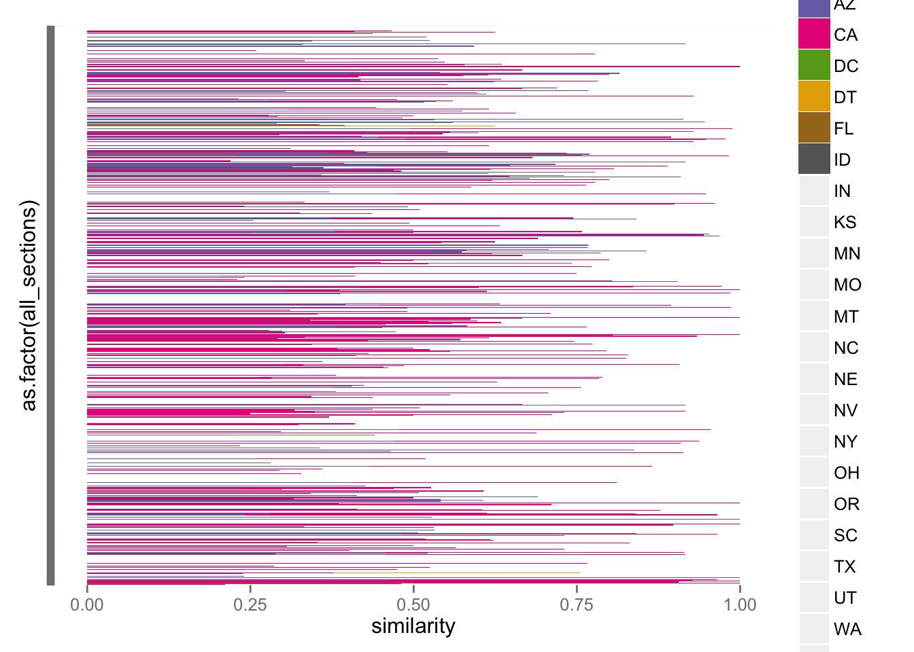
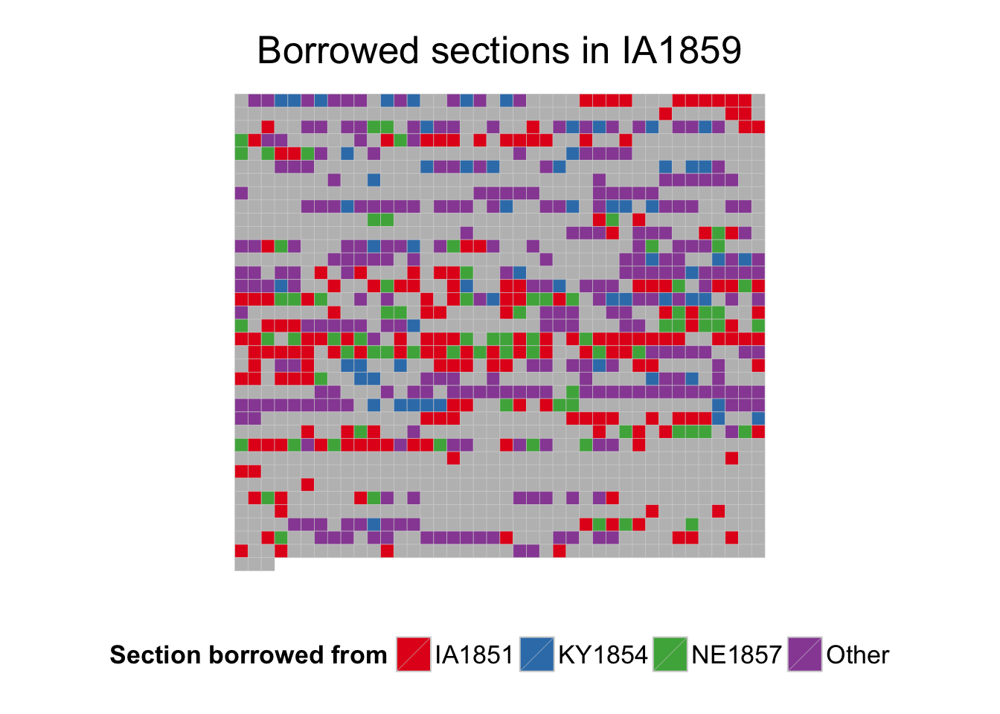

    library("dplyr")
    library("stringr")
    library("readr")
    library("tidyr")
    library("ggplot2")
    library("RColorBrewer")
    source("R/extract-date.R")
    source("R/extract_code_names.R")

The aim of this notebook is to create a function that takes a code's
abbreviation (e.g., `NY1850`) and creates a data frame with each of the
sections in that code with the best match to a non-anachronistic code.

Read in the data.

    load("cache/lsh-sections.rda")
    scores <- section_scores %>% 
      rename(section_a = a, section_b = b) %>% 
      mutate(code_a = extract_code_names(section_a),
             code_b = extract_code_names(section_b),
             year_a = extract_date(code_a),
             year_b = extract_date(code_b)) %>% 
      rename(similarity = score) %>% 
      mutate(dissimilarity = 1 - similarity)
    scores

    ## Source: local data frame [534,229 x 8]
    ## 
    ##        section_a     section_b similarity code_a code_b year_a year_b
    ##            (chr)         (chr)      (dbl)  (chr)  (chr)  (int)  (int)
    ## 1  AK1900-000010 AR1868-000060 0.21333333 AK1900 AR1868   1900   1868
    ## 2  AK1900-000010 AR1874-000090 0.36842105 AK1900 AR1874   1900   1874
    ## 3  AK1900-000010 AZ1865-000020 0.20967742 AK1900 AZ1865   1900   1865
    ## 4  AK1900-000010 CA1850-000030 0.17647059 AK1900 CA1850   1900   1850
    ## 5  AK1900-000010 CA1851-000030 0.11940299 AK1900 CA1851   1900   1851
    ## 6  AK1900-000010 CA1858-000030 0.20967742 AK1900 CA1858   1900   1858
    ## 7  AK1900-000010 CA1868-000030 0.11940299 AK1900 CA1868   1900   1868
    ## 8  AK1900-000010 CA1872-000220 0.03614458 AK1900 CA1872   1900   1872
    ## 9  AK1900-000010 CA1872-002310 0.19354839 AK1900 CA1872   1900   1872
    ## 10 AK1900-000010 CO1877-000010 0.17307692 AK1900 CO1877   1900   1877
    ## ..           ...           ...        ...    ...    ...    ...    ...
    ## Variables not shown: dissimilarity (dbl)

    source("R/summarize-borrowings.R")
    source("R/best-section-matches.R")

Apply this to three codes:

    CA1851 <- best_section_matches("CA1851", scores, threshold = 0.2)
    CA1851

    ## Source: local data frame [761 x 6]
    ## 
    ##     all_sections match_code match_section similarity dissimilarity
    ##            (chr)      (chr)         (chr)      (dbl)         (dbl)
    ## 1  CA1851-000010     CA1850 CA1850-000010  0.2857143    0.71428571
    ## 2  CA1851-000020     NY1849 NY1849-000870  0.3333333    0.66666667
    ## 3  CA1851-000030         NA            NA         NA            NA
    ## 4  CA1851-000040     CA1850 CA1850-000040  1.0000000    0.00000000
    ## 5  CA1851-000050     CA1850 CA1850-000070  0.9583333    0.04166667
    ## 6  CA1851-000060     CA1850 CA1850-000090  0.5652174    0.43478261
    ## 7  CA1851-000070     NY1851 NY1851-001370  0.8181818    0.18181818
    ## 8  CA1851-000080     NY1850 NY1850-006570  0.4827586    0.51724138
    ## 9  CA1851-000090     CA1850 CA1850-000120  0.7500000    0.25000000
    ## 10 CA1851-000100     NY1850 NY1850-006590  0.4285714    0.57142857
    ## ..           ...        ...           ...        ...           ...
    ## Variables not shown: original_code (chr)

    summarize_borrowings(CA1851)

    ## Source: local data frame [10 x 5]
    ## 
    ##    original_code match_code mean_similarity     n percentage_sections
    ##            (chr)      (chr)           (dbl) (int)               (dbl)
    ## 1             NA         NA              NA   314         0.412614980
    ## 2         CA1851     NY1850       0.4924215   301         0.395532194
    ## 3         CA1851     CA1850       0.5066487    53         0.069645204
    ## 4         CA1851     NY1851       0.5650909    28         0.036793693
    ## 5         CA1851     NY1849       0.5247201    23         0.030223390
    ## 6         CA1851     MN1851       0.5214114    19         0.024967148
    ## 7         CA1851     NY1848       0.4821353    12         0.015768725
    ## 8         CA1851     KY1851       0.5563984     6         0.007884363
    ## 9         CA1851     MO1849       0.5906650     3         0.003942181
    ## 10        CA1851     IA1851       0.2497914     2         0.002628121

    IA1859 <- best_section_matches("IA1859", scores, threshold = 0.2)
    IA1859

    ## Source: local data frame [1,441 x 6]
    ## 
    ##     all_sections match_code match_section similarity dissimilarity
    ##            (chr)      (chr)         (chr)      (dbl)         (dbl)
    ## 1  IA1859-000010         NA            NA         NA            NA
    ## 2  IA1859-000020     KY1851 KY1851-000030  0.4782609     0.5217391
    ## 3  IA1859-000030     KY1851 KY1851-000040  0.4843750     0.5156250
    ## 4  IA1859-000040     KY1854 KY1854-000050  0.8000000     0.2000000
    ## 5  IA1859-000050     KY1854 KY1854-000060  0.4310345     0.5689655
    ## 6  IA1859-000060     KY1851 KY1851-000080  0.8750000     0.1250000
    ## 7  IA1859-000060     KY1854 KY1854-000070  0.8750000     0.1250000
    ## 8  IA1859-000060     NY1850 NY1850-006070  0.8750000     0.1250000
    ## 9  IA1859-000070     KY1851 KY1851-000090  0.3333333     0.6666667
    ## 10 IA1859-000080     KY1851 KY1851-000100  0.4255319     0.5744681
    ## ..           ...        ...           ...        ...           ...
    ## Variables not shown: original_code (chr)

    summarize_borrowings(IA1859)

    ## Source: local data frame [37 x 5]
    ## 
    ##    original_code match_code mean_similarity     n percentage_sections
    ##            (chr)      (chr)           (dbl) (int)               (dbl)
    ## 1             NA         NA              NA   679          0.47120056
    ## 2         IA1859     IA1851       0.5500450   212          0.14712006
    ## 3         IA1859     NE1857       0.5501511    92          0.06384455
    ## 4         IA1859     KY1851       0.5113950    85          0.05898681
    ## 5         IA1859     KY1854       0.4649492    83          0.05759889
    ## 6         IA1859     OH1853       0.4721614    50          0.03469813
    ## 7         IA1859     KS1859       0.4580576    40          0.02775850
    ## 8         IA1859     NE1859       0.4735716    39          0.02706454
    ## 9         IA1859     TN1858       0.4240072    26          0.01804303
    ## 10        IA1859     IN1852       0.4242937    24          0.01665510
    ## ..           ...        ...             ...   ...                 ...

    UT1870 <- best_section_matches("UT1870", scores, threshold = 0.2)
    UT1870

    ## Source: local data frame [1,166 x 6]
    ## 
    ##     all_sections match_code match_section similarity dissimilarity
    ##            (chr)      (chr)         (chr)      (dbl)         (dbl)
    ## 1  UT1870-000010     CA1851 CA1851-000010  0.2115385     0.7884615
    ## 2  UT1870-000020     CA1851 CA1851-000030  0.2407407     0.7592593
    ## 3  UT1870-000020     CA1868 CA1868-000030  0.2407407     0.7592593
    ## 4  UT1870-000030     AR1868 AR1868-000070  0.5000000     0.5000000
    ## 5  UT1870-000030     CA1850 CA1850-000040  0.5000000     0.5000000
    ## 6  UT1870-000030     CA1851 CA1851-000040  0.5000000     0.5000000
    ## 7  UT1870-000030     DC1857 DC1857-001000  0.5000000     0.5000000
    ## 8  UT1870-000030     MN1859 MN1859-000030  0.5000000     0.5000000
    ## 9  UT1870-000030     MT1865 MT1865-000020  0.5000000     0.5000000
    ## 10 UT1870-000030     NV1861 NV1861-000020  0.5000000     0.5000000
    ## ..           ...        ...           ...        ...           ...
    ## Variables not shown: original_code (chr)

    summarize_borrowings(UT1870)

    ## Source: local data frame [40 x 5]
    ## 
    ##    original_code match_code mean_similarity     n percentage_sections
    ##            (chr)      (chr)           (dbl) (int)               (dbl)
    ## 1         UT1870     NV1869       0.5019711   281          0.24099485
    ## 2         UT1870     CA1858       0.5418125   165          0.14150943
    ## 3         UT1870     CA1851       0.5274077   146          0.12521441
    ## 4         UT1870     NV1861       0.5366067   138          0.11835334
    ## 5         UT1870     AZ1865       0.5268139   107          0.09176672
    ## 6             NA         NA              NA    70          0.06003431
    ## 7         UT1870     CA1868       0.5616885    58          0.04974271
    ## 8         UT1870     ID1864       0.5125771    51          0.04373928
    ## 9         UT1870     MT1865       0.5195664    48          0.04116638
    ## 10        UT1870     NY1850       0.4581878    14          0.01200686
    ## ..           ...        ...             ...   ...                 ...

Make a plot of code borrowings.

    plot_borrowings <- function(state_borrowings) {
      state_borrowings %>% 
        mutate(state = str_extract(match_code, "\\w\\w")) %>% 
        ggplot(aes(x = as.factor(all_sections), y = similarity, fill = state)) +
        geom_bar(stat = "identity") +
        coord_flip() +
        scale_x_discrete(labels = NULL) +
        scale_y_continuous(limits = c(0, 1)) +
        scale_fill_brewer(palette = "Dark2")
    }

Plot some borrowings:

    plot_borrowings(CA1851)

    ## Warning: Removed 314 rows containing missing values (position_stack).

    ## Warning in is.na(labels): is.na() applied to non-(list or vector) of type
    ## 'NULL'

    plot_borrowings(UT1870)

    ## Warning: Removed 70 rows containing missing values (position_stack).

    ## Warning in RColorBrewer::brewer.pal(n, pal): n too large, allowed maximum for palette Dark2 is 8
    ## Returning the palette you asked for with that many colors

    ## Warning in is.na(labels): is.na() applied to non-(list or vector) of type
    ## 'NULL'

    ## Warning in RColorBrewer::brewer.pal(n, pal): n too large, allowed maximum for palette Dark2 is 8
    ## Returning the palette you asked for with that many colors

Heatmaps of borrowings:

    col_vector <- function(n, cols) {
      r <- trunc(n / cols)
      remainder <- n %% cols
      if (remainder > 0)
        c(rep(1:cols, r), 1:remainder)
      else
        c(rep(1:cols, r))
    } 
    row_vector <- function(n, cols) {
      out <- NULL
      for (i in seq_len((n / cols) + 1)) {
         out <- c(out, rep(i, cols))
      }
      out[1:n]
    }
    n_columns <- 40

Plot CA

    other <- c("MN1851", "IA1851", "KY1851", "MO1849")
    best_section_matches("CA1851", scores, threshold = 0.3) %>% 
      mutate(match_code = ifelse(match_code %in% other,
                                 "Other", match_code)) %>% 
      mutate(., 
             column = col_vector(nrow(.), n_columns),
             row = row_vector(nrow(.), n_columns),
             match_code = as.factor(match_code)) %>% 
      ggplot(aes(x = column, y = -row, fill = match_code, alpha)) +
      geom_tile(color = "lightgray") + 
      theme_minimal(base_size = 16) +
      coord_equal() +
      labs(x = NULL, y = NULL, title = "Borrowed sections in CA1851",
           fill = "Section borrowed from") + 
      theme(legend.position = "bottom", 
            axis.ticks = element_blank(),
            axis.line = element_blank(), axis.text = element_blank(),
            panel.background = element_blank(), panel.grid = element_blank()) +
      scale_fill_brewer(type = "qual", na.value = "gray", palette = 6)

Plot UT1859

    other <- c("NY1848", "WI1849", "CA1850", "NY1849", "IA1851", "NY1851", "WI1856",
               "WI1858", "NY1853", "CA1851", "CA1858", "IA1859", "IN1852", "MA1858",
               "MN1851", "TN1858", "KY1851", "MA1836", "MO1856", "NE1857", "OH1853",
               "TX1855", "KS1859", "NE1859")
    best_section_matches("UT1859", scores, threshold = 0.3) %>% 
      mutate(match_code = ifelse(match_code %in% other,
                                 "Other", match_code)) %>% 
      mutate(., 
             column = col_vector(nrow(.), n_columns),
             row = row_vector(nrow(.), n_columns),
             match_code = as.factor(match_code)) %>% 
      ggplot(aes(x = column, y = -row, fill = match_code)) +
      geom_tile(color = "lightgray") + 
      theme_minimal(base_size = 16) +
      coord_equal() +
      labs(x = NULL, y = NULL, title = "Borrowed sections in UT1859",
           fill = "Section borrowed from") + 
      theme(legend.position = "bottom", 
            axis.ticks = element_blank(),
            axis.line = element_blank(), axis.text = element_blank(),
            panel.background = element_blank(), panel.grid = element_blank()) +
      scale_fill_brewer(type = "qual", na.value = "gray", palette = 6)

Plot WA1855

    white_list <- c("CA1850", "NY1850", "WI1849", "CA1851", "OR1854", "IN1852")
    other_maker <- function(x, white_list) {
      ifelse(is.na(x), NA, ifelse(x %in% white_list, x, "Other"))
    }
    best_section_matches("WA1855", scores, threshold = 0.3) %>% 
      mutate(match_code = other_maker(match_code, white_list)) %>% 
      mutate(., 
             column = col_vector(nrow(.), n_columns),
             row = row_vector(nrow(.), n_columns),
             match_code = as.factor(match_code)) %>% 
      ggplot(aes(x = column, y = -row, fill = match_code)) +
      geom_tile(color = "lightgray") + 
      theme_minimal(base_size = 16) +
      coord_equal() +
      labs(x = NULL, y = NULL, title = "Borrowed sections in WA1855",
           fill = "Section borrowed from") + 
      theme(legend.position = "bottom", 
            axis.ticks = element_blank(),
            axis.line = element_blank(), axis.text = element_blank(),
            panel.background = element_blank(), panel.grid = element_blank()) +
      scale_fill_brewer(type = "qual", na.value = "gray", palette = 6)

OR 1854

    white_list <- c("CA1850", "NY1853", "NY1851", "WI1849", "MN1851", "NY1850", "CA1851")
    other_maker <- function(x, white_list) {
      ifelse(is.na(x), NA, ifelse(x %in% white_list, x, "Other"))
    }
    best_section_matches("OR1854", scores, threshold = 0.15) %>% 
      mutate(match_code = other_maker(match_code, white_list)) %>% 
      mutate(., 
             column = col_vector(nrow(.), n_columns),
             row = row_vector(nrow(.), n_columns),
             match_code = as.factor(match_code)) %>% 
      ggplot(aes(x = column, y = -row, fill = match_code)) +
      geom_tile(color = "lightgray") + 
      theme_minimal(base_size = 16) +
      coord_equal() +
      labs(x = NULL, y = NULL, title = "Borrowed sections in OR1854",
           fill = "Section borrowed from") + 
      theme(legend.position = "bottom", 
            axis.ticks = element_blank(),
            axis.line = element_blank(), axis.text = element_blank(),
            panel.background = element_blank(), panel.grid = element_blank()) +
      scale_fill_brewer(type = "qual", na.value = "gray", palette = 6)

NC1868

    white_list <- c("DT1668", "NY1851", "NY1849", "NY1850", "WI1858", "WI1856")
    other_maker <- function(x, white_list) {
      ifelse(is.na(x), NA, ifelse(x %in% white_list, x, "Other"))
    }
    best_section_matches("NC1868", scores, threshold = 0.3) %>% 
      mutate(match_code = other_maker(match_code, white_list)) %>% 
      mutate(., 
             column = col_vector(nrow(.), n_columns),
             row = row_vector(nrow(.), n_columns),
             match_code = as.factor(match_code)) %>% 
      ggplot(aes(x = column, y = -row, fill = match_code)) +
      geom_tile(color = "lightgray") + 
      theme_minimal(base_size = 16) +
      coord_equal() +
      labs(x = NULL, y = NULL, title = "Borrowed sections in NC1868",
           fill = "Section borrowed from") + 
      theme(legend.position = "bottom", 
            axis.ticks = element_blank(),
            axis.line = element_blank(), axis.text = element_blank(),
            panel.background = element_blank(), panel.grid = element_blank()) +
      scale_fill_brewer(type = "qual", na.value = "gray", palette = 6)

IA1859

    white_list <- c("IA1851", "NE1857", "KY1854")
    other_maker <- function(x, white_list) {
      ifelse(is.na(x), NA, ifelse(x %in% white_list, x, "Other"))
    }
    best_section_matches("IA1859", scores, threshold = 0.3) %>% 
      mutate(match_code = other_maker(match_code, white_list)) %>% 
      mutate(., 
             column = col_vector(nrow(.), n_columns),
             row = row_vector(nrow(.), n_columns),
             match_code = as.factor(match_code)) %>% 
      ggplot(aes(x = column, y = -row, fill = match_code)) +
      geom_tile(color = "lightgray") + 
      theme_minimal(base_size = 16) +
      coord_equal() +
      labs(x = NULL, y = NULL, title = "Borrowed sections in IA1859",
           fill = "Section borrowed from") + 
      theme(legend.position = "bottom", 
            axis.ticks = element_blank(),
            axis.line = element_blank(), axis.text = element_blank(),
            panel.background = element_blank(), panel.grid = element_blank()) +
      scale_fill_brewer(type = "qual", na.value = "gray", palette = 6)

NM1897

    white_list <- c("MO", "NM", "IA", "NY", "MN", "WI")
    other_maker <- function(x, white_list) {
      ifelse(is.na(x), NA, ifelse(x %in% white_list, x, "Other"))
    }
    best_section_matches("NM1897", scores, threshold = 0.15) %>% 
      mutate(match_state = str_sub(match_code, start = 1, end = 2)) %>% 
      mutate(match_state = other_maker(match_state, white_list)) %>% 
      mutate(., 
             column = col_vector(nrow(.), n_columns),
             row = row_vector(nrow(.), n_columns),
             match_code = as.factor(match_code)) %>% 
      ggplot(aes(x = column, y = -row, fill = match_state)) +
      geom_tile(color = "lightgray") + 
      theme_minimal(base_size = 16) +
      coord_equal() +
      labs(x = NULL, y = NULL, title = "Borrowed sections in NM1897",
           fill = "Section borrowed from") + 
      theme(legend.position = "bottom", 
            axis.ticks = element_blank(),
            axis.line = element_blank(), axis.text = element_blank(),
            panel.background = element_blank(), panel.grid = element_blank()) +
      scale_fill_brewer(type = "qual", na.value = "gray", palette = 6)

Summarize by state

    summarize_by_state <- function(section_list) {
      section_list %>% 
        mutate(match_state = str_sub(match_code, start = 1, end = 2)) %>% 
        group_by(match_state) %>% 
        summarize(original_code = unique(original_code),
                  mean_similarity = mean(similarity),
                  n = n()) %>% 
        mutate(percentage_sections = n / nrow(section_list)) %>% 
        arrange(desc(n)) %>% 
        select(original_code, match_state, mean_similarity, n, percentage_sections)
    }
