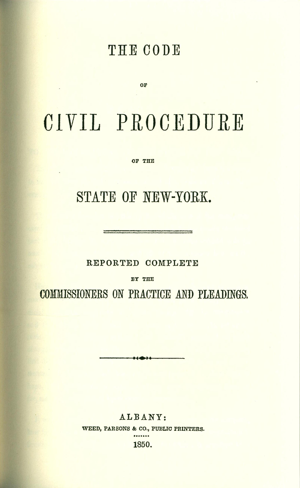

## The New York "Field Code"

## Code commissioners

## {data-background="field-code-states-map.jpeg"}

## "Paste-pot" procedure codes

## {data-background="WA1855.png"}

## {data-background="NV1861.png"}

## {data-background="code-to-code.png"}

## {data-background="state-to-state.png"}
